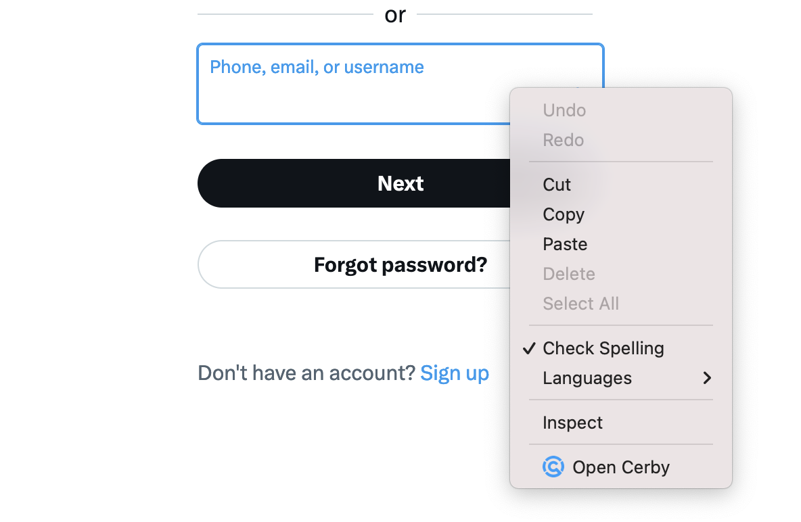

# Troubleshooting: The Cerby icon for the inline menu is not displayed

When logging in manually to an account using the inline menu of the Cerby browser extension, sometimes the login pages and input fields are not identified, causing the Cerby to disappear from the input fields.

To solve this issue, first, ensure you have the Cerby browser extension installed in your web browser and with an active session. To do so, complete the following steps:

1. Look for the Cerby logo where your web browser displays the installed extensions. Depending on the outcome, perform any of the following actions:

   * Install the browser extension if the Cerby logo is missing. Navigate to the corresponding link depending on your web browser:
     * [Firefox](https://addons.mozilla.org/en-US/firefox/addon/cerby-s-browser-extension/)
     * [Google Chrome](https://chrome.google.com/webstore/detail/cerbys-browser-extension/clccplmaaeihbagbefjinmclielobnkb)
     * [Microsoft Edge](https://microsoftedge.microsoft.com/addons/detail/cerbys-browser-extension/bbaiiaogfdgpbapebajffliefkfipoif)
     * [Safari](https://apps.apple.com/mx/app/cerby-web-extension/id1581820030?l=en&mt=12)

     **NOTE:** If your company uses a mobile device management (MDM) solution to install the applications in all of the corporate computers, contact your IT or Security department.

After installing the Cerby browser extension, continue to step 2.

   * Continue to step 2 if the Cerby logo is displayed.

2. Open the Cerby browser extension popup. Depending on the page displayed, perform any of the following actions:

   * Log in to your workspace if the **Welcome to Cerby** page is displayed because you don’t have an active session. After logging in, continue to step 3.
   * Continue to step 3 if your accounts or secrets are displayed because you have an active session.

3. Reload the login page of the web browser tab you left open.

After reloading the page, the Cerby logo should be displayed inside the input fields. If the logo is still missing, open the Cerby browser extension manually from the context menu. To do so, complete the following steps:

1. Click inside any of the input fields to activate it.
2. Right-click inside the input field. The context menu is displayed, as shown in **Figure 1**.

**Figure 1**. Context menu of the web browser

3. Select the **Open Cerby** option. The Cerby logo is displayed inside the input field.

Now you can log in to your account using the inline menu of the Cerby browser extension.
