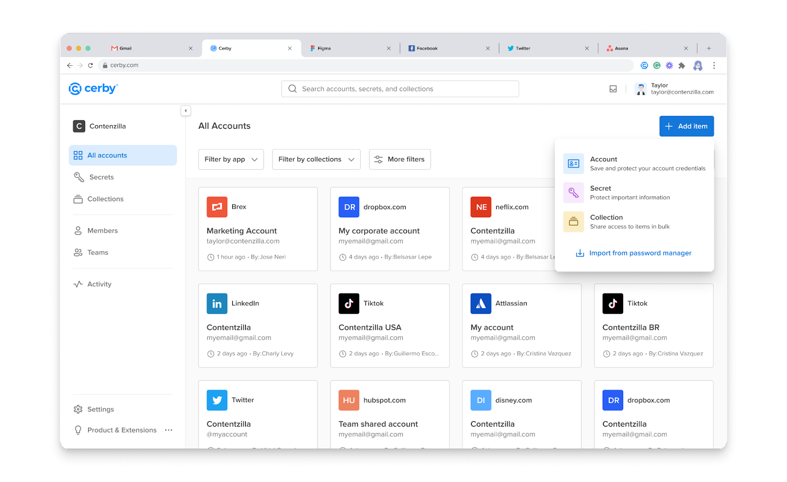
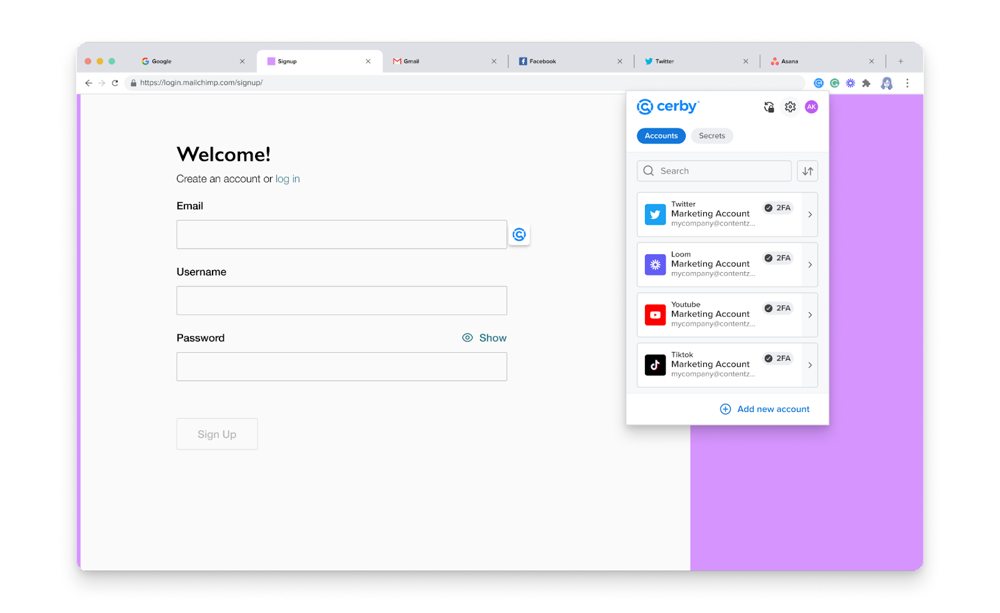
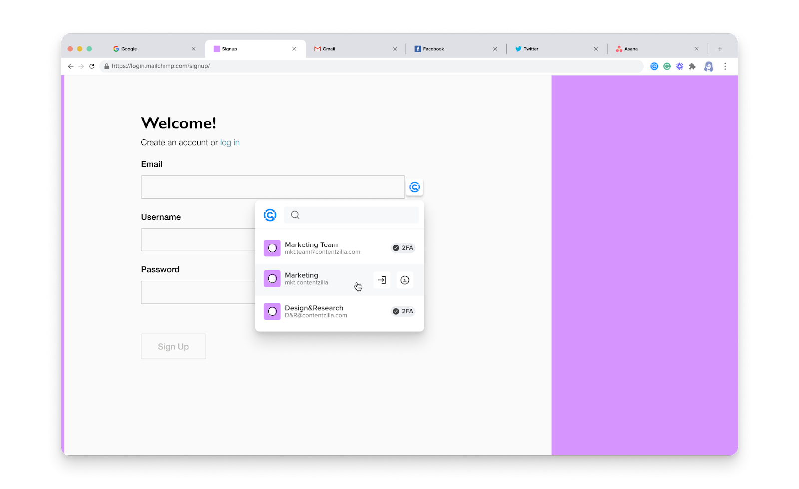
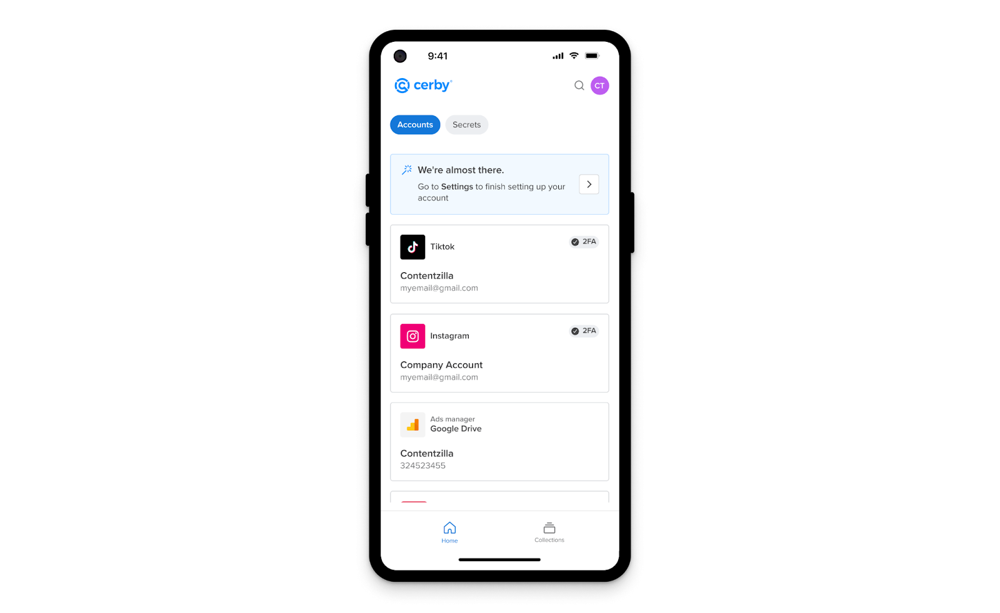
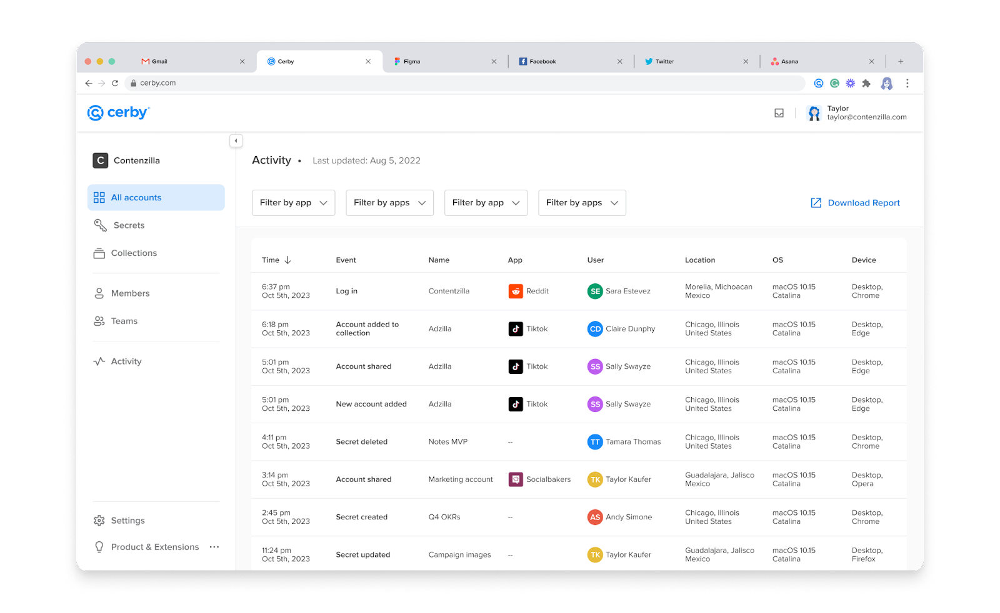
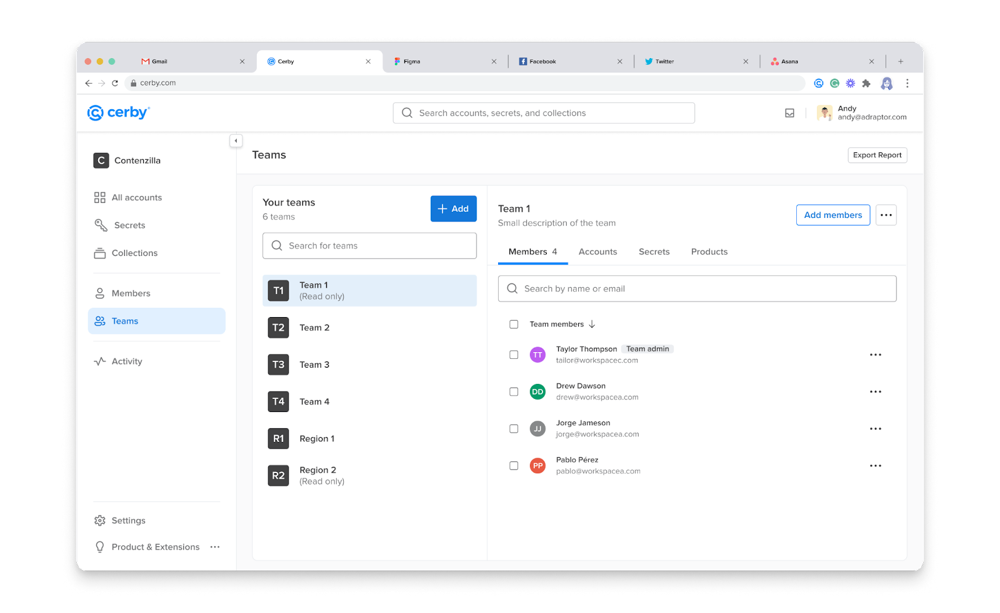
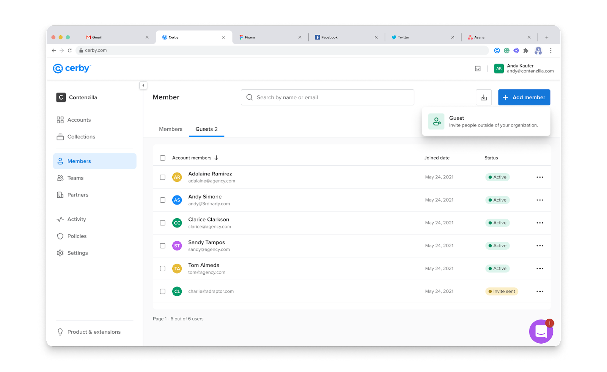

# Get started with Cerby Protect

Hi there, welcome to Cerby Protect!

First, thank you for choosing Cerby to safeguard your sensitive data. We are a cybersecurity company focused on helping you and your organization manage and secure access to your day-to-day applications.

Cerby Protect is our enterprise password management product designed to provide you with a seamless security experience and increase your productivity by making it easier for you and your colleagues to access the accounts and information you need to do your job.

In the following sections, we will walk you through the basic information and the first steps to take to start using Cerby Protect:

  * [Learn how Cerby Protect works](get-started-with-cerby-protect.md#learn-how-cerby-protect-works)
  * [Log in to your workspace](get-started-with-cerby-protect.md#log-in-to-your-workspace)
  * [Install the Cerby client apps](get-started-with-cerby-protect.md#install-the-cerby-client-apps)
  * [Set up your trusted devices](get-started-with-cerby-protect.md#set-up-your-trusted-devices)
  * [Add your items to Cerby](get-started-with-cerby-protect.md#add-your-items-to-cerby)
  * [Share your items](get-started-with-cerby-protect.md#share-your-items)
  * [Enhance the security of your accounts](get-started-with-cerby-protect.md#enhance-the-security-of-your-accounts)
  * [Boost collaboration](get-started-with-cerby-protect.md#boost-collaboration)
* * *

## Learn how Cerby Protect works

Cerby Protect is an enterprise password management product built to safeguard the following corporate sensitive data:

* **Accounts:** The digital records with the login information (such as username and password) for specific apps or service providers.
* **Secrets:** The important information that you need to save and share securely with your colleagues, such as license keys, serial numbers, and network login data. You may know secrets by the name of secure notes.

The following sections explain how we protect your data and increase your productivity:

* [Zero Knowledge architecture](get-started-with-cerby-protect.md#zero-knowledge-architecture)
* [Cerby client apps](get-started-with-cerby-protect.md#cerby-client-apps)
* [Security best practices](get-started-with-cerby-protect.md#security-best-practices)
* [Item management and sharing](get-started-with-cerby-protect.md#item-management-and-sharing)
* [User activity monitoring](get-started-with-cerby-protect.md#user-activity-monitoring)

### Zero Knowledge architecture

The Cerby platform offers two encryption schemes for the vaults where you store your data: cloud and local encryption. The goal is to let you select the approach that aligns with your security needs, regulatory compliance, and operational requirements.

By default, when you set up a new workspace, the Cerby platform creates a cloud vault, but you can create additional vaults for your organization to leverage the local encryption scheme and a Zero Knowledge architecture.

With local encryption vaults, Cerby has no knowledge or access to the decryption keys and the data stored within the encrypted vaults. Your data remains private and confidential because vaults are logically separated and the architecture prevents access from unauthorized parties, including Cerby.

Additionally, you can share vaults with specific users to ensure no one else in the workspace can access the stored items.

The following table describes the main characteristics that differentiate both schemes.

**Characteristic**| **Cloud encryption vaults**| **Local encryption vaults**
---|---|---
Location of encryption and decryption keys| The encryption keys, decryption keys, and encrypted data are stored on Cerby's servers in the cloud.| The decryption keys are stored on trusted devices registered by Cerby’s servers; they are never stored in any Cerby system.
How encryption and decryption is performed| Cerby’s encryption system in AWS Key Management Service (KMS) is the only authorized system to perform data encryption and decryption to provide users with the data they need when using the Cerby platform.| Only registered trusted devices can access and decrypt the local encryption vaults with customer data. Users must have access to such devices, authenticate to Cerby, and have a valid session under the OpenID Connect (OIDC) protocol to access data.
Recommended use| Cerby recommends cloud encryption vaults for customers with limited IT or security expertise and little control or security enforcement on company devices. | Cerby recommends local encryption vaults for customers with robust IT or Security teams and strict controls on company devices because encryption and decryption are decentralized, without relying on Cerby's infrastructure or resources.

**Table 1.** Characteristics of the cloud and local encryption vaults

For more information on the encryption schemes, read the [How Cerby protects your data with cloud and local encryption](https://cerby-test.gitbook.io/cerby-test/management/credential-management/vaults/how-cerby-protects-your-data-with-cloud-and-local-encryption) article.

### Cerby client apps

The Cerby platform comprises three client apps that work together to provide you with the best experience as a Cerby Protect user:

* [Cerby web app](get-started-with-cerby-protect.md#cerby-web-app)
* [Cerby browser extension](get-started-with-cerby-protect.md#cerby-browser-extension)
* [Cerby mobile app](get-started-with-cerby-protect.md#cerby-mobile-app)

### Cerby web app

The Cerby web app is the interface that enables you to perform all the management actions on the accounts and secrets you save in Cerby, as well as on the users who belong to your workspace.

The following are the actions you can perform:

* Create and manage your vaults and recovery key.
* Set up and manage your trusted devices.
* Add an account, edit the account details, manage access to the account, and start the automatic login via the Cerby browser extension.
* Create second factors (Cerby-managed phone numbers and email addresses) for your accounts to receive verification codes and enhance the automatic login experience.
* View and manage the messages sent to your second factors via the Shared Inbox.
* Store the backup codes when configuring multi-factor authentication (MFA) manually for your accounts.
* Add a secret and manage access to it.
* Import items from a password manager.
* Create a collection and manage access to it.
* Search through your items.
* View and export the list of workspace members.
* Add a self-managed team and manage team access to items.
* Add a partner and manage partner access to items.
* Create and manage distribution lists.
* View your billing information.
* View the user activity on your workspace and items.

You can use any web browser to access the Cerby web app, and all of your interactions are through a dashboard that’s displayed after logging in to your workspace, as shown in **Figure 1**.

**Figure 1.** Cerby web app dashboard for Cerby Protect users

Our Cerby web app is constantly updated by our Development team, meaning that you always have access to the latest features and improvements.

### Cerby browser extension

The Cerby browser extension is an add-on for web browsers that complements the user experience. The following are the actions you can perform:

* Log in to your accounts automatically by leveraging the autofill feature on login pages. Automatic login is guided by in-context alerts for visibility on what happens in every step and what to do if the process fails or needs your intervention.
* Log in to your accounts manually by leveraging the inline menu.
* Generate secure passwords based on custom policies to sign up for applications or rotate your passwords manually.
* View and copy your account details to log in to your apps manually.
* View the content of a secret and download its file attachments.
* View and copy verification codes when MFA is turned on using Cerby-managed second factors or authenticator app.
* Search through your items.
* Save your credentials when logging in or signing up for an app.

After logging in to your workspace with the Cerby browser extension, your interactions are through a popup and an inline menu, as shown in **Figure 2** and **Figure 3**.

**Figure 2.** Cerby browser extension popup for Cerby Protect users

**Figure 3.** Cerby browser extension inline menu for Cerby Protect users

The Cerby browser extension can be installed on demand or distributed to all corporate computers via a Mobile Device Management (MDM) solution. You receive the latest version automatically each time the Development team pushes a new version.

The following web browsers are supported for MacOS and Windows computers:

* Safari
* Microsoft Edge
* Mozilla Firefox
* Google Chrome
* Island

### Cerby mobile app

The Cerby mobile app is the interface that enables you to access the account and secrets from your mobile phone. The following are the actions you can perform:

* Log in to your accounts using the autofill service in the login screen of your apps.
* View and copy your account details to log in to your apps manually.
* Set up Cerby as an authenticator app by scanning a QR code or entering a secret key to turn on MFA managed by Cerby.
* View and copy verification codes when MFA is turned on using Cerby-managed second factors or authenticator app.
* View the content of a secret and download its file attachments.
* View your collections.
* View the workspace members and teams who have access to your accounts and secrets.
* Search through your items.
* Receive push notifications and confirm verification challenges to access your items.

You can use iOS and Android devices to access the Cerby mobile app, and all of your interactions are through a dashboard that’s displayed after logging in to your workspace, as shown in **Figure 4**.

**Figure 4.** Cerby mobile app dashboard for Cerby Protect users

### Security best practices

Cerby Protect provides the following security best practices that you can implement to keep your data safe:

* Connect apps that don’t support security standards with your identity provider (IdP) as follows:
  * Using Security Assertion Markup Language (SAML) or OIDC for authentication.
  * Using the corporate identity credentials managed by your IdP to provide secure access to your apps.
  * Extending single sign-on (SSO) authentication to any app and enforcing access control.
  * Setting up automatic user provisioning with the System for Cross-domain Identity Management (SCIM) specification to manage the creation and synchronization of user accounts.
* Generate strong passwords for your accounts.
* Turn on the MFA method determined by your IdP to log in to your Cerby workspace.
* Turn on MFA for your apps using verification methods managed by Cerby: phone numbers, email addresses, and authenticator app.
* Leverage the role-based access control (RBAC) strategy that enables you to automatically grant permissions depending on your workspace role. These roles restrict the features you can access in the Cerby platform.
* Set up identity challenges for users to confirm their identity whenever they want to view a secret.

### Item management and sharing

Cerby Protect takes a step further as an enterprise password management product by enabling you to share access to your items to boost collaboration and productivity.

When sharing accounts, secrets, or collections, you can implement the principle of least privilege and assign other users the following roles on the items:

* **Owner:** Your colleagues can view and share the items with other users and edit the item details.
* **Collaborator:** Your colleagues can only view the item details. For accounts, they can only log in to applications.

The dashboard in the Cerby web app enables you to keep your items organized as follows:

* You can use filters to display the item cards.
* You can display the item cards as a grid and a list.
* You can create collections to group items and share them in bulk with other users or teams.
* You can use the search bar to find items.

### User activity monitoring

Cerby Protect provides you with visibility around the user activity within a workspace and on shared items to perform the following actions:

* Audit item management practices by looking into who has accessed your workspace and items, when did it happen, from where, and through which device. With this information, you can identify and prevent unauthorized access and security threats.
* Comply with your company security policies and regulations.
* Identify the source of potential threats and take action to minimize impact and prevent incidents from happening again.

This information is available through the **Activity** view, as shown in **Figure 5**.

**Figure 5.** **Activity** view in the Cerby dashboard

User activity information can be exported to a third-party service, such as [Sumo Logic](https://cerby-test.gitbook.io/cerby-test/management/reporting/how-to-export-analytics-data-from-cerby-to-sumo-logic) or Splunk.

* * *

## Log in to your workspace

Now that you know the basic concepts of Cerby Protect, it’s time to start using the Cerby platform. The first step is to log in to your workspace.

A workspace is a collaboration environment where organizations manage and secure access to their accounts, secrets, and collections. After the Workspace Owners create a workspace, its name is displayed and identified as follows: **< workspace name>.cerby.com**.

The login experience is the same for all the Cerby client apps: in the login screen or page, you must enter the workspace name first; then, you are redirected to your IdP’s login page to enter your credentials and authenticate via SSO. If your IdP has MFA enforced, you’ll be prompted to set it up.

To log in to your workspace, follow the instructions in the [How to log in to your Cerby workspace](https://cerby-test.gitbook.io/cerby-test/getting-started/video-how-to-log-in-to-your-cerby-workspace) video.



**IMPORTANT:** Ensure your IT team has granted you access to Cerby via the SSO integration of your IdP. Also, ask for the workspace name.



* * *

## Install the Cerby client apps

For an optimal user experience, Cerby recommends installing the browser extension and mobile app.

If your company uses an MDM service, the Cerby browser extension may have been already installed on your computer. To install it manually, navigate to the website according to your web browser and follow the installation instructions:

  * [Firefox](https://addons.mozilla.org/en-US/firefox/addon/cerby-s-browser-extension/)
  * [Google Chrome](https://chrome.google.com/webstore/detail/cerbys-browser-extension/clccplmaaeihbagbefjinmclielobnkb)
  * [Microsoft Edge](https://microsoftedge.microsoft.com/addons/detail/cerbys-browser-extension/bbaiiaogfdgpbapebajffliefkfipoif)
  * [Safari](https://apps.apple.com/mx/app/cerby-web-extension/id1581820030?l=en&mt=12)

To install the Cerby mobile app, navigate to the website according to your operating system and follow the installation instructions:

  * [Android](https://play.google.com/store/apps/details?id=com.cerby)
  * [iOS](https://apps.apple.com/co/app/cerby/id1533747684)
* * *

## Set up your trusted devices

Whenever you log in to your workspace with a new device using any of the Cerby client apps, you will be automatically prompted to set it up as a trusted device. This is a security requirement.

To set up a trusted device, follow the instructions in the [How to set up and manage your trusted devices](https://cerby-test.gitbook.io/cerby-test/management/workspace-configuration/trusted-devices/set-up-trusted-sessions-on-your-devices) article.

* * *

## Add your items to Cerby

Now that you have accessed the Cerby platform, let’s start adding items. Currently, you have three options to do so in Cerby:

  * [Import items from LastPass](get-started-with-cerby-protect.md#import-items-from-lastpass)
  * [Add items](get-started-with-cerby-protect.md#add-items)
  * [Save credentials at login](get-started-with-cerby-protect.md#save-credentials-at-login)

The following sections describe each option.

### Import items from LastPass

With our Password Manager Importer, you can transfer from LastPass your corporate folders, passwords, secure notes, attachments, and user access permissions at the same time.

All of the items inside LastPass folders are transferred as follows:

  * Folders become collections with the same items inside.
  * Passwords become accounts.
  * Secure notes and their attachments become secrets.
  * User access permissions are automatically matched with the users in your IdP who were assigned to your workspace and have a Cerby account.



**IMPORTANT:** You can only import the folders to which you have the Administrator permissions in LastPass.



To import your items from LastPass, follow the instructions in the [Import items to Cerby](https://cerby-test.gitbook.io/cerby-test/management/credential-management/item-importer/migrate-from-lastpass-to-cerby) article or the [How to import items to Cerby via the Password Manager Importer](https://cerby-test.gitbook.io/cerby-test/management/credential-management/item-importer/video-how-to-import-items-to-cerby-via-the-password-manager-importer) video.

### Add items

The process to add items to Cerby is different depending on the item type:

  * [Accounts](get-started-with-cerby-protect.md#accounts)
  * [Secrets](get-started-with-cerby-protect.md#secrets)
  * [Collections](get-started-with-cerby-protect.md#collections)

The following sections describe the instructions for each item type.

### Accounts

Accounts are the digital records with the login information (such as username and password) for specific apps or service providers. Each account has its corresponding card in the Cerby dashboard.

When adding an account, you are granted the **Owner** role on it. To add an account, follow the instructions in the [How to add and share an account, and view your account details](https://cerby-test.gitbook.io/cerby-test/how-to-use-cerby/cerby-web-app/accounts/video-how-to-add-and-share-an-account-and-view-your-account-details) video.

### Secrets

Secrets are the important information that you need to save and share securely with your colleagues, such as license keys, serial numbers, and network login data. You may know them by the name of secure notes, and each secret has its corresponding card in the Cerby dashboard.

You can set up identity challenges for users with shared access to confirm their identity each time they want to view a secret.

When adding a secret, you are granted the **Owner** role on it. To add a secret, follow the instructions in the [Add a secret to Cerby](https://cerby-test.gitbook.io/cerby-test/support-and-use-cases/explore/explore-secrets) article or [How to add and share a secret](https://cerby-test.gitbook.io/cerby-test/how-to-use-cerby/cerby-web-app/secrets/video-how-to-add-and-share-a-secret) video.

### Collections

Collections are groups of accounts and secrets that you can create to help you keep your items organized, and they help you share items in bulk with other users or teams. Each collection has its corresponding card in the Cerby dashboard.

You can only add to a collection the items to which you have the **Owner** role. When creating a collection, you are granted the **Owner** role on it. To create a collection, follow the instructions in the [How to create and share a collection](https://cerby-test.gitbook.io/cerby-test/management/credential-management/collections/video-how-to-create-and-share-a-collection) video.

### Save credentials at login

With Cerby Protect, you can easily save the credentials you enter to access an app manually through its login page. By activating the Save credentials at login feature, the Cerby browser extension can automatically identify your login attempt and suggest you add the account to Cerby.

To save your credentials at login, follow the instructions in the [How to save your credentials at login via the Cerby browser extension](https://cerby-test.gitbook.io/cerby-test/how-to-use-cerby/cerby-browser-extension/autosave-an-account-at-login-or-signup-with-the-cerby-browser-extension) article.

* * *

## Share your items

With your items added to Cerby, let’s start sharing them. Currently, you have two options to do so:

  * [Share items within your workspace](get-started-with-cerby-protect.md#share-items-within-your-workspace)
  * [Share items via a public link](get-started-with-cerby-protect.md#share-items-via-a-public-link)

The following sections describe each option.

### Share items within your workspace

With Cerby Protect, you can share your items with users and teams within your workspace. When sharing any item, you must assign one of the two following roles:

  * **Owner:** Your colleagues can view and share the items with other users and edit the item details.
  * **Collaborator:** Your colleagues can only view the item details. For accounts, they can only log in to applications.

The process of sharing items is different depending on the item type:

  * [Accounts](get-started-with-cerby-protect.md#accounts)
  * [Secrets](get-started-with-cerby-protect.md#secrets)
  * [Collections](get-started-with-cerby-protect.md#collections)

The following sections describe the instructions for each item type.

### Accounts

To share an account, follow the instructions in the [How to add and share an account, and view your account details](https://cerby-test.gitbook.io/cerby-test/how-to-use-cerby/cerby-web-app/accounts/video-how-to-add-and-share-an-account-and-view-your-account-details) video.

### Secrets

To share a secret, follow the instructions in the [How to add and share a secret](https://cerby-test.gitbook.io/cerby-test/how-to-use-cerby/cerby-web-app/secrets/video-how-to-add-and-share-a-secret) video.

### Collections

To share a collection, follow the instructions in the [How to create and share a collection](https://cerby-test.gitbook.io/cerby-test/management/credential-management/collections/video-how-to-create-and-share-a-collection) video.

### Share items via a public link

With Cerby Protect, you can share your items with external collaborators via a public link. This access grant for accounts and secrets is temporary, because you can set an expiration time and one-time access.

To share accounts and secrets with external collaborators, follow the instructions in the [How to share items with external users via a link](https://cerby-test.gitbook.io/cerby-test/how-to-use-cerby/cerby-web-app/accounts/share-items-with-external-users-via-a-link) article.

* * *

## Enhance the security of your accounts

With Cerby Protect, you can take the following actions to enhance the security of your accounts:

  * [Create Cerby-managed second factors for your accounts](get-started-with-cerby-protect.md#create-cerby-managed-second-factors-for-your-accounts)
  * [Turn on MFA for your accounts](get-started-with-cerby-protect.md#turn-on-mfa-for-your-accounts)
  * [Generate secure passwords](get-started-with-cerby-protect.md#generate-secure-passwords)
  * [Track user activity](get-started-with-cerby-protect.md#track-user-activity)

The following sections describe each action.

### Create Cerby-managed second factors for your accounts

Cerby provides and manages securely generated email addresses and phone numbers you can use for your accounts and across your organization.

By managing this service, Cerby can improve the logging-in process of your apps by automatically filling your verification codes when MFA is turned on with an email address or a phone number as a verification method.

If needed, you can also copy the codes manually from your **Shared Inbox** using any of the Cerby client apps.

To create Cerby-managed second factors through the Cerby web app, follow the instructions in the [How to add a Cerby-managed email or phone number to your account](https://cerby-test.gitbook.io/cerby-test/how-to-use-cerby/cerby-web-app/accounts/protecting-your-account/video-how-to-add-a-cerby-managed-email-or-phone-number-to-your-account) video.

### Turn on MFA for your accounts

Cerby recommends always turning on MFA for the accounts that offer such a security method. You can set up Cerby as an authenticator app to provide you with time-based one-time passwords (TOTPs).

By managing this service, Cerby can improve the logging-in process of your apps by automatically filling the TOTPs you need. If needed, you can also copy them using the Cerby browser extension and Cerby mobile app.

To turn on MFA for your accounts, follow the instructions in the [Turn on MFA for your accounts](https://cerby-test.gitbook.io/cerby-test/how-to-use-cerby/cerby-web-app/accounts/protecting-your-account/video-how-to-turn-on-mfa-for-an-account-manually) video. The setup process is performed through the Cerby mobile app.

### Generate secure passwords

With the Password generator feature, available through the browser extension, Cerby Protect provides you with a way to generate secure passwords anytime, selecting the strength rules applicable to your app or service provider.

After generating the password, you can use it to sign up for a new account and add it to Cerby, or to rotate the password manually for your accounts both in Cerby and in your app.

To generate a password, follow the instructions in the [How to generate passwords using the Cerby browser extension](https://cerby-test.gitbook.io/cerby-test/how-to-use-cerby/cerby-browser-extension/generate-secure-passwords-using-the-cerby-browser-extension) article.

### Track user activity

As mentioned above, in the [User activity monitoring](https://docs.google.com/document/d/1aYdODisApQ2eMKDIk112q3A1YysRWtpwPTK3L646wP4/edit#heading=h.ablitwav9jlg) section, Cerby Protect provides you with visibility around the user activity within a workspace and on the shared items to which you have the **Owner** role.

The **Activity** view is enabled for all users to see the activity of the accounts to which they have the **Owner** role, and **Workspace Admins** can see the activity of all accounts.

You can perform the following actions from this view:

  * See the **Activity Log** table with information in the following columns:
    * **Time:** It is the time when the user activity was registered.
    * **Event:** It is the type of activity performed by the user, for example, **Account Added To Collection** , **Password Retrieved** , or**Login to Cerby**.
    * **Account:** It is the label of the account in Cerby related to the user activity.
    * **App:** It is the application related to the user activity.
    * **User:** It is the name of the user in Cerby who performed the activity.
    * **Location:** It is the geographical location of the user.
    * **OS:** It is the operating system of the user’s device.
    * **Device:** It is the user’s device from where the activity was registered.
  * Download the activity report in a CSV file by clicking the **Download CSV** button.
* * *

## Boost collaboration

Cerby Protect offers the following features to boost your collaboration:

  * [Teams](get-started-with-cerby-protect.md#teams)
  * [Partners](get-started-with-cerby-protect.md#guest-users)

The following sections describe each feature.

### Teams

With Teams, you can simplify user and access management. This feature helps you and your company support groups of users assigned to items and automatically change the Cerby role and user account provisioning to all group members.

You have the following two options to create teams in Cerby:

  * Create a group of users in the corporate directory managed by your IdP, such as Okta and Azure AD, and replicate it automatically as a team in Cerby.
  * Create a self-managed team selecting users from your workspace.

You can manage all of your teams through the **Teams** view, as shown in **Figure 6**.

**Figure 6.** **Teams** view in the Cerby dashboard

To add and manage a team, follow the instructions in the [How to use Teams](https://cerby-test.gitbook.io/cerby-test/management/workspace-configuration/user-management/teams/how-to-use-teams) article. You can also see the [How to add a self-managed team](https://cerby-test.gitbook.io/cerby-test/management/workspace-configuration/user-management/teams/video-how-to-add-a-self-managed-team) video.

### Guest users

With guest users, you have a secure way to collaborate closer with external parties. This feature helps you and your company support inviting any collaborator who doesn't belong to your domain or corporate directory to join your Cerby workspace.

After joining Cerby, all of the workspace members from your organization who have the **Owner** role on collections, accounts, and secrets can share their items directly with guest users.

**Workspace Admins** can manage guest users through the **All Members** view, as shown in **Figure 7**.

**Figure 7.** **All members** view

To add and manage a guest user, follow the instructions in the [How to invite a guest user to your workspace](https://cerby-test.gitbook.io/cerby-test/support-and-use-cases/explore/explore-guest-users) article.
