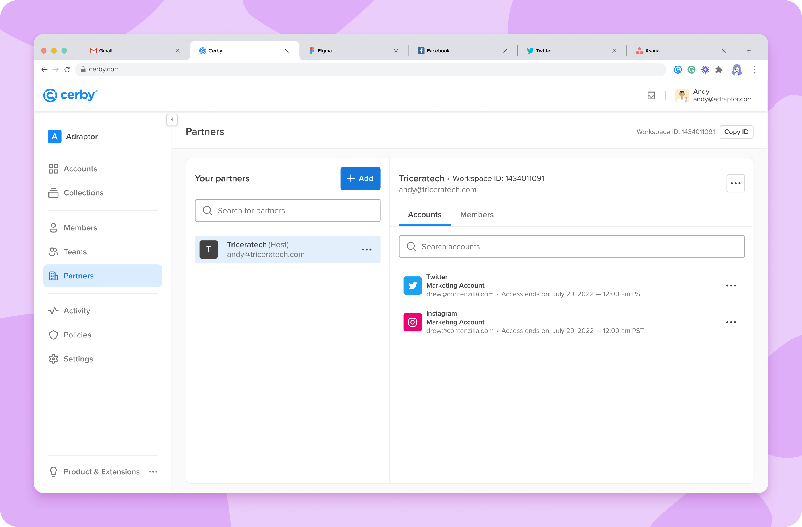

# What are Partners?

**Release date:** October 5, 2022

We know you do your best to find the safest way to share the credentials of your apps when you collaborate with an external party. But what happens when you lose control over your accounts? Here's where the Partners feature of Cerby can help.

With security in mind, we've just released our Partners feature to enable you to securely share accounts and collections with members who don't belong to your domain, such as contractors, agencies, partners, vendors, and clients.

After establishing a partnership, partners can access these accounts through Cerby without ever seeing, copying, and pasting (or memorizing, gasp!) your username and password.

This feature gives you and your company complete control over the accounts and visibility into their usage.

Check out the **Partners** view in your Cerby dashboard, as shown in **Figure 1**.

<figure><figcaption></figcaption></figure>

**Figure 1. Partners View**

## What can you do with Partners?

With Partners, you can do the following:

* Share accounts and collections with a guest workspace and remove access to them when needed.
* Access shared accounts from the guest workspace.
* Track activity on the shared accounts through the **Activity** view.
* Leverage an **Account Manager** role able to ask the host workspace to share accounts with other members of the guest workspace.

## Can’t wait, let's start

If you are as excited as us about this new feature, here’s what you have to do next:

  1. Make sure both the host and guest workspaces exist in Cerby.
  2. Establish a partnership via a request sent from the host workspace.
  3. Start sharing accounts with your partner.

For detailed instructions and descriptions of the supported features, read the article [Add a host-guest partnership](https://cerby-test.gitbook.io/cerby-test/management/workspace-configuration/user-management/partners/host-guest/add-a-host-guest-partnership) article.

## Hold on. There's more?

Sit tight. Our Development team is currently working on the following features to be released soon:

* The ability to share a collection via a partnership
* The ability to set an expiration date for the partnership
