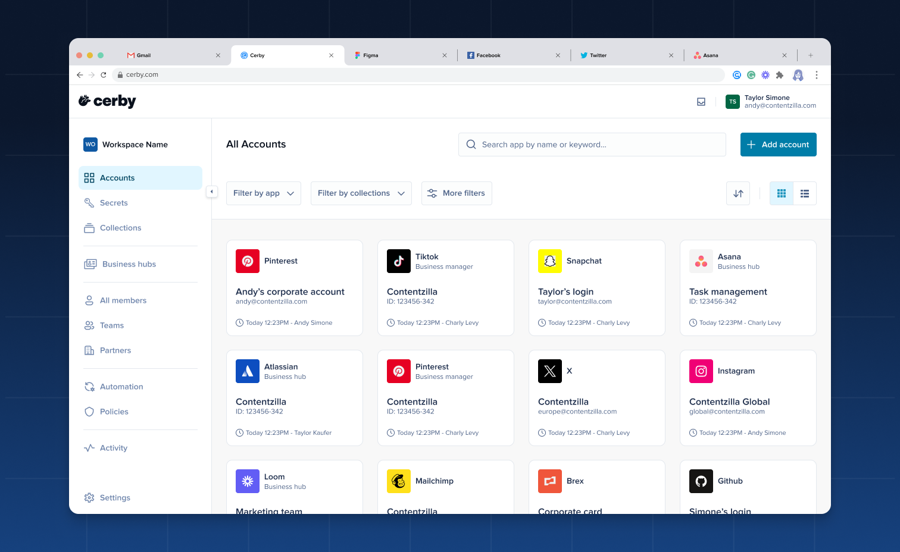
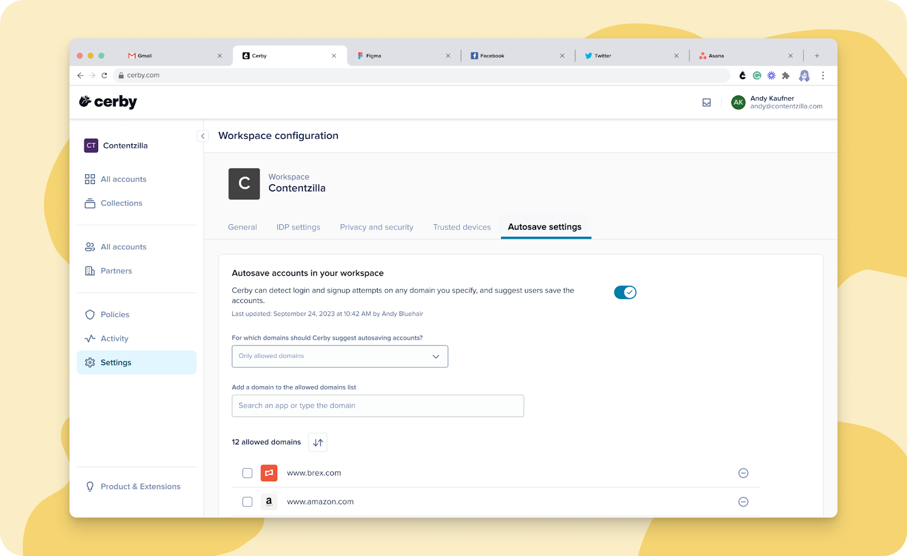
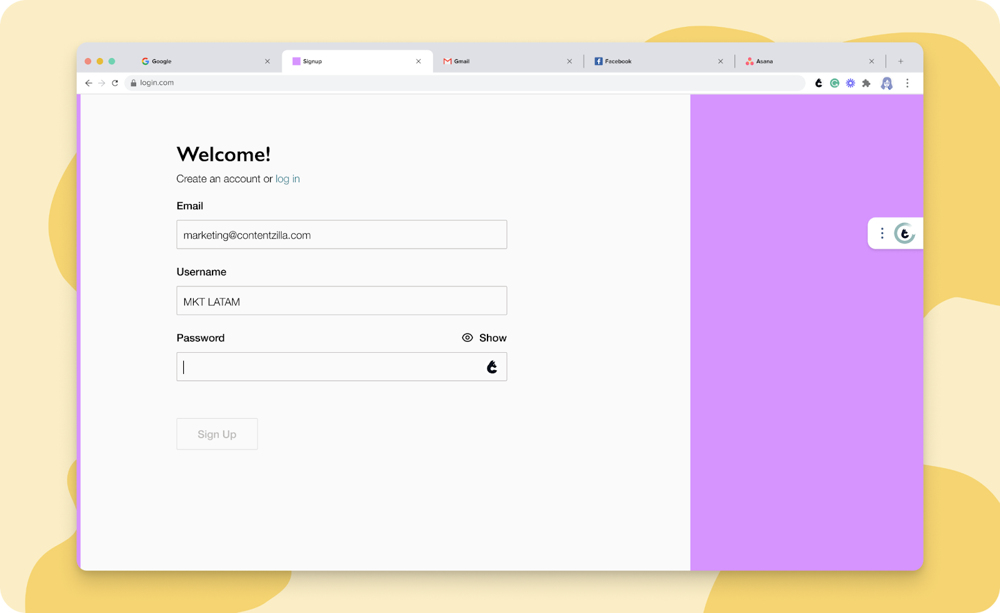
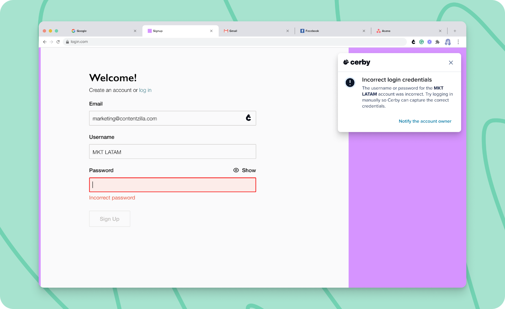

# Release Notes - July 10, 2024

## New features

The following are the new features and improvements we released across the Cerby platform:

* We’re thrilled to unveil our brand-new look as part of our ongoing evolution! You’ll notice our new logo and refreshed interactions across the Cerby platform, which aim to make your journey with us even more enjoyable.
We can’t wait for you to explore these changes, so make sure you have the latest versions of our client apps:
Want to take a peek? **Figure 1** shows the revamped look of your Cerby web app dashboard.

**Figure 1.** Cerby web app dashboard

Welcome to a new chapter in your Cerby experience.

    * Cerby browser extension v1.0.331
    * Cerby mobile app v1.0.190 for iOS and v1.0.168 for Android

<figure><figcaption></figcaption></figure>

* Let's keep you hyped with good news. We've been sniffing new ground, leading to the successful deployment of our cloud infrastructure in Singapore, Hong Kong, and Tokyo!
With this strategic move, we can provide top-notch service to our valued customers across Asia with enhanced performance and reliability.

* Talking about suiting customer needs, we’ve also released a new multi-factor authentication method (MFA) for you to confirm your identity for sensitive actions, such as viewing or editing a secret.
In addition to push notifications sent to the Cerby mobile app, you can now receive a magic link in your email address.
For more information, read the article [Confirm your identity with Cerby's MFA methods](https://cerby-test.gitbook.io/cerby-test/management/identity-providers-idps/scim/set-up-your-identity-with-cerby-s-mfa-methods).

* Ready for a long-awaited release? Well, we’ve launched the second phase of the account autosave feature, improving the seamless experience of saving your login and signup credentials in Cerby with the browser extension.
In addition to the current individual experience, workspace **Admins** and **Super Admins** can now manage which website domains are allowed or excluded for all workspace users. All configuration is done through the Cerby web app, as shown in **Figure 2**.

**Figure 2.** **Autosave settings** tab in the **Workspace Configuration** page of the Cerby web app

For more information, read the article [Explore account autosave](https://cerby-test.gitbook.io/cerby-test/support-and-use-cases/explore/explore-account-autosave).

<figure><figcaption></figcaption></figure>

* We know you wanted to have more visibility in your App integrations. That’s why we released a feature that enables workspace **Super Admins** in **All-Access Mode** to search and view the assets of their SaaS and paid social apps connected to Cerby.
* Regarding App integrations, we have an update for your Meta Business Manager.
Now, you don’t need a connected account to perform a check for updates from the Cerby web app. Also, you can control from the app details page if you want to request users to save their username and password in Cerby; it’s just a matter of activating the corresponding switch.

### Cerby web app

Check out what’s new in our Cerby web app:

* We've fine-tuned the report you can export from the **All members** view to provide you with more information to take action on the security of your workspace and users.
You can now see a column in the CSV file with the status of each user's Cerby account related to multi-factor authentication (MFA).

* When you trigger an automated task to log in to your accounts from the Cerby web app, but don’t have the browser extension installed, you are now prompted to install it.
* We’ve trained our Cerby platform to automatically refresh your web app when we release a new version of it, even when you leave your web browser open with an active session. Rest assured, as you’ll always have the latest features and updates.
* This one goes to all of our users who could potentially have “checkmarkophobia.” We have stopped showing the security widget for all of the accounts that don’t support or don’t have the following features enabled to protect them:
Now, we show the widget on the account details page if at least one of the aforementioned features is enabled.

    * Cerby-managed phone number
    * Cerby-managed email address
    * Multi-factor authentication (MFA) managed by Cerby as an authenticator app
    * Password rotation
    * Saving backup codes

### Cerby browser extension

Explore the latest features in our Cerby browser extension:

* The in-context alerts received some love to provide you with a better user experience.
We’ll still guide you through the automated login to your accounts with the Cerby browser extension but in a less intrusive way. Now, we only display messages when your intervention is required or when you need to know what’s happening.
**Figures 3** and**4** show how the new in-context alerts look.

**Figure 3.** In-context alert when performing an automated login

**Figure 4.** In-context alert displaying a message when manual intervention is required

<figure><figcaption></figcaption></figure>

<figure><figcaption></figcaption></figure>

* We don’t want you to lose your password when signing up for an account and using the password generator through the inline menu of the Cerby browser extension. In v1.0.312, we added a Copy icon to the inline menu so you can copy to the clipboard the password you generate.

### Cerby mobile app

Dive into the newest additions to our Cerby mobile app:

* Collaboration with external parties is now a reality when using the Cerby mobile app. You can now share your accounts with a [local partner](https://cerby-test.gitbook.io/cerby-test/support-and-use-cases/explore/explore-partners).
The process is the same as sharing accounts with other users or teams: through the account details screen after tapping the **Share** icon. This feature was released in v1.0.167 for Android.

* Here’s another one on account management in v1.0.167 for Android. You can now view the different roles a user has been granted on an account, whether a direct share or via a team. Just tap the right arrow icon from the **Sharing** section of the account details screen to display the **View members** screen. There, select the user from the list to display the **Update Roles** screen with the details of each role grant.
As a bonus, you can also update the user role or remove user access from the **Update Roles** screen.

* For your convenience, we’ve added a **Download** icon for you to save the attachments of a secret on your mobile phone both for iOS and Android.

## Fixes

Take note of the issues addressed and resolved by the Development team behind the Cerby platform.

### Cerby web app

* The issue with not deleting a device when canceling the setup of a trusted session through the Cerby web app was fixed.
* The issue with workspace **Super Admins** and **Owners** being able to view the button to share an account, even when they only have the **Collaborator** role on the account, was fixed.
* The issue with being able to interact with a native partner user's list of roles was fixed. It’s not possible to update these roles from the app details page on the Cerby web app.
* The issue with displaying the **Connect account** dialog box after clicking the **Check for updates** button from the **More options** drop-down list of a TikTok Business Center app card, even when an account is already connected, was fixed.
* The issue with displaying the “There was an unexpected error” message instead of redirecting users to the Cerby web app dashboard when trying to access an account through the URL was fixed.

### Cerby browser extension

* The issue with displaying empty results after using the global search bar of the Cerby browser extension when having only one account was fixed in v1.0.316.
* The issue with restricting access to the settings page of Instagram when the user role on an account is updated from **Collaborator** to **Owner** in Cerby was fixed in v1.0.317.
* The issue with not restricting access to the settings page of X (Twitter) when the user role on an account is **Collaborator** in Cerby was fixed in v1.0.318.
* The issue with being unable to trigger an automated task to log in to an account through the inline menu of the Cerby browser extension for Firefox was fixed in v1.0.319.

### Cerby mobile app

* The issue with opening browser tabs instead of the TikTok and Twitch apps when clicking the **Log in** icon in the corresponding account details screen was fixed in iOS v1.0.179.
* The issue with pasting email addresses when sharing an account and not being able to find the existing user was fixed in iOS v1.0.188.
* The issue with being prompted to set up a trusted session again for the Cerby mobile app after clearing caché and local data from the mobile phone’s storage was fixed.
* The issue with being unable to scan the QR code to set up Cerby as an authenticator app for Twitch was fixed in v1.0.188 for iOS and v1.0.167 for Android.
