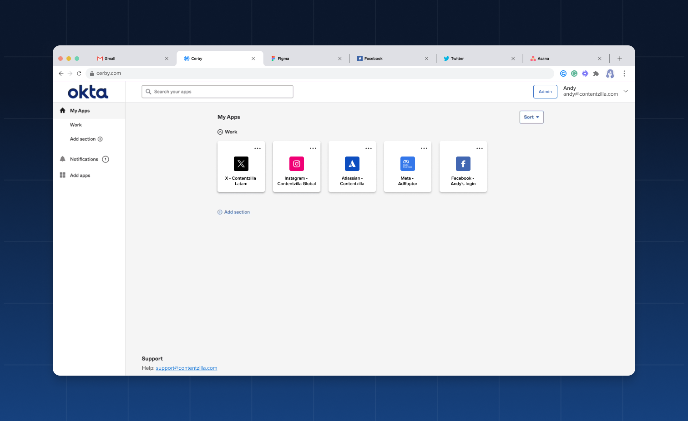

# Achieve unified and secure access to disconnected apps with Okta and Cerby

**Release date:** August 21, 2024
​

The partnership between Cerby and Okta has reached new heights. Through our latest release, **Extended account access** , you can enjoy a seamless login experience to your disconnected apps from Okta powered by Cerby's automation.

This feature is intended for customers who want to centralize access in Okta instead of using the Cerby dashboard and extend identity and lifecycle management from Okta to any disconnected app through Cerby.

With the Extended account access feature, you can log in to the accounts you have saved in your Cerby workspace from Okta. These accounts, as you know them in Cerby, become applications in the Okta dashboard with their corresponding chiclet.

The goal of this feature is to let you and your collaborators trigger secure automated logins from the Okta chiclets by leveraging the Cerby browser extension, which takes over the work of autofilling the credentials and verification codes when Cerby manages multi-factor authentication (MFA).

Cerby's role-based access control (RBAC) system is the source of truth for determining which accounts are synced and extended to Okta and for whom: users see an Okta chiclet whenever a corresponding assigned account exists in Cerby with the **Owner** or **Collaborator** role.

Check out how your accounts are displayed as chiclets in the Okta dashboard, as shown in **Figure 1**.

**Figure 1.** Chiclets in the Okta dashboard synced from accounts in Cerby

The Extended account access feature is currently available to Cerby workspaces configured with Okta as the identity provider (IdP). In the future, other IdPs could be supported. For more information about this feature, read the article [Explore Extended account access](https://cerby-test.gitbook.io/cerby-test/support-and-use-cases/explore/explore-extended-account-access).

* * *

## What can you do with Extended account access?

With the Extended account access feature, you can do the following:

  * Extend the Okta dashboard to include disconnected apps managed by Cerby while maintaining a seamless and secure user experience.
  * Enable users to see their Cerby accounts as chiclets on their Okta dashboard when they are synced for the first time. These Okta chiclets are updated whenever account or collection events occur in Cerby, such as user and team access permission changes.
  * Grant or remove user and team access in Cerby quickly and easily due to Cerby’s [Okta Integration Network](https://www.okta.com/integrations/cerby/) (OIN) listing, which supports user provisioning and deprovisioning with Okta via the System for Cross-domain Identity Management (SCIM) specification.
* * *

## Can’t wait, let’s start

If you are as excited as us about this new feature, here’s what you have to do next:

  1. Turn on the Extended account access feature.
  2. Sync and extend your accounts to Okta.
  3. Start logging in to your accounts from the corresponding chiclets in your Okta dashboard.

* * *

## Hold on. There's more?

Sit tight. Our Development team is currently working on the following features to be released soon:

  * The ability to remove all synced accounts and collections for all workspace members in all Okta dashboards.
