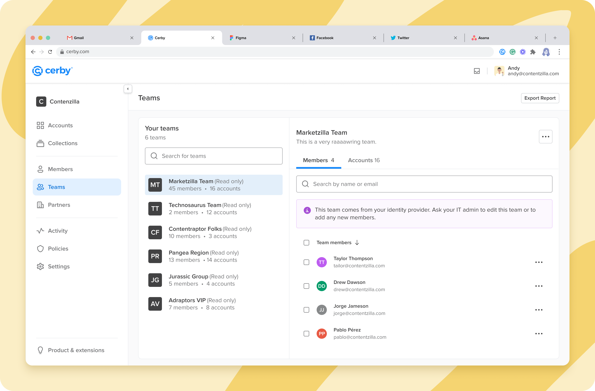

# What are Teams?

**Release date:** October 10, 2022

Have you wanted to share accounts with a group of users? Now you can with the Teams feature in Cerby.

We’ve just released this feature to simplify user and access management. The following are the key benefits of Teams:

* Share accounts and collections to a team instead of manually to each user.
* Change a team’s access level to an account, thereby impacting the access level of all the team members.
* Replicate the grouping structure from your identity provider (IDP) or create your own team based on members of your corporate directory.

Check out the **Teams** view in your Cerby dashboard.

## What can you do with Teams?

With Teams, you can do the following:

* Create a group of users in the corporate directory managed by your IDP and replicate it automatically as a team in Cerby.

**NOTE:** Currently, Cerby only supports groups from Okta as an IDP.

* Create a team manually in Cerby with the members of your corporate directory.
* Add or remove users from groups in your IDP and automatically see these updates in Cerby.
* Add or remove members from a team.
* See the existing teams in your workspace and their team members.
* Share accounts and collections with teams. Also, edit and remove access to these accounts and collections.
* Track activity on the shared accounts through the **Activity** view as you currently do.

## Can’t wait, let's start

If you are as excited as us about this new feature, here’s what you have to do next to use Teams:

1. Create a team by replicating a group from your IDP or by adding members in Cerby.
2. Start sharing accounts with your teams.

For detailed instructions and descriptions of the supported features, see the [How to use Teams](https://cerby-test.gitbook.io/cerby-test/management/workspace-configuration/user-management/teams/how-to-use-teams) article.

## Hold on. There's more?

Sit tight. Our Development team is currently working on the following features to be released soon:

* The ability to share a collection with a team
* The Subteams feature to create a team inside a team
* The integration with groups from Azure AD
* A **Team All-Access Mode** to see the accounts and collections shared with all of the teams within a Cerby workspace
