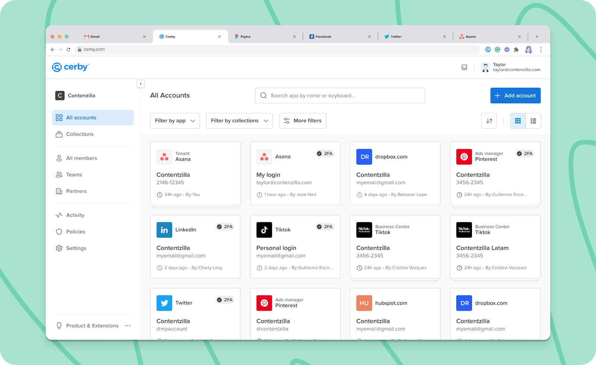

# What are Tenants?

**Release date:** December 23, 2022

Do your day-to-day activities involve painstaking manual tasks to manage multiple seat-based software-as-a-service (SaaS) products? Take a break with the Tenants feature in Cerby.

We’ve just released this feature to simplify user and access management. We define tenants as applications where customers pay for the number of seats or licenses instead of sessions that could be used by one or multiple users simultaneously.

In seat-based apps, users belong to collaboration spaces (such as workspaces, teams, and dashboards) with different roles and permissions, and admins manage their access. For example, Apple, Asana, Atlassian, Calendly, or GitHub.

By adding a tenant and connecting it to Cerby, you can centrally and securely manage all your colleagues from Cerby. That way, you only interact with one user interface for multiple apps, and you can match users to your corporate directory.

The following are the key benefits of Tenants:

* Provision and deprovision users automatically in your apps.
* Identify who uses your apps and their role, and match them to their profile in your corporate directory.
* Manage users, roles, and account access from one interface.
* Invite your colleagues to Cerby and secure their access to your app by complying with security best practices, such as multi-factor authentication (MFA) and password rotation.

Check out the tenants you can add to Cerby, as shown in **Figure 1**.

**Figure 1.** Tenant account cards in the **All accounts** view

## What can you do with Tenants?

With Tenants, you can do the following:

* Add a tenant to Cerby to manage your seat-based apps.
* Import all users of your app and their roles to Cerby.
* Match all the user accounts of your apps to the corresponding Cerby accounts. Cerby accounts can be linked to the corporate directory managed by your identity provider (IdP).
* Manage access to your apps with single sign-on (SSO) through Cerby.
* Onboard and protect user accounts through Cerby.
* Audit who has access to your tenant from inside and outside your company.
* Change from Cerby the native role that your users have in the app.
* Invite new users to join your app through Cerby and with an identity managed by Cerby.
* Provision and deprovision users in your app automatically from your IdP via Teams.
* Remove tenant members automatically from Cerby.
* Implement and automate security policies on user accounts from Cerby:
  * Turn on and off MFA
  * Change password
* Track activity on user accounts through the **Activity** view.

## Can’t wait, let’s start

If you are as excited as us about this new feature, here’s what you have to do next:

1. Add a service account to Cerby.
2. Connect the service account to your app.
3. Import users and roles to Cerby and match them to their Cerby account.
4. Manage access and users from Cerby.
5. Implement security policies.
6. Request Cerby to support more tenants by sending an email to [support@cerby.com](mailto:support@cerby.com).

For detailed instructions and descriptions of the supported features, read the [How to use Tenants](https://cerby-test.gitbook.io/cerby-test/support-and-use-cases/explore/explore-business-hubs) article.

## Hold on. There's more?

Sit tight. Our Development team is currently working on the following features to be released soon:

* Support assets management from Cerby.
