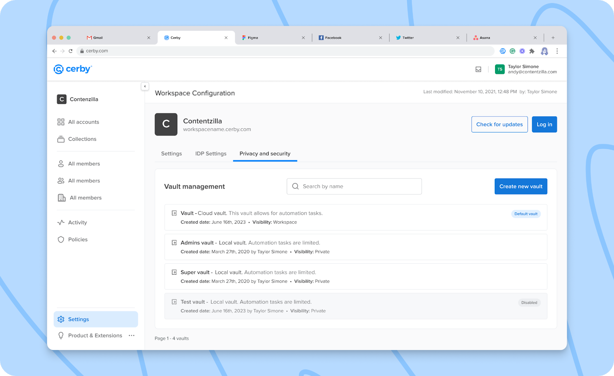

# What is local encryption?

**Release date:** October 2, 2023

It’s probably our most anticipated feature release. We are proud to introduce local encryption support for the vaults you use to save your accounts and secrets in Cerby.

This encryption scheme empowers customers with robust IT or Security teams and strict controls on company devices to leverage a Zero Knowledge architecture, where Cerby has no knowledge or access to the decryption keys and the data stored in customer vaults.

With local encryption, a set of encryption keys is generated and stored exclusively on trusted devices registered by Cerby's servers, and decryption happens decentralized on such devices. Customer data remains private and confidential because the architecture prevents access from unauthorized parties, including Cerby.

When you create a vault with local encryption, also known as a local vault, you can control who has shared access to it. Additionally, only authenticated and authorized users with trusted devices already registered by Cerby can access the vault.

During the vault sharing process, a copy of the vault is replicated automatically into each device along with an encrypted copy of the vault data encryption keys. The goal is to enable the trusted devices to encrypt and decrypt vault data locally.

Check out the **Vault management** section in the **Privacy and security** tab of the **Workspace Configuration** page, as shown in **Figure 1**.

**Figure 1.** **Vault management** section in the **Privacy and security** tab

For more information about the encryption schemes at Cerby, read the [How Cerby protects your data with cloud and local encryption](https://cerby-test.gitbook.io/cerby-test/management/credential-management/vaults/how-cerby-protects-your-data-with-cloud-and-local-encryption) article.

## What can you do with local encryption?

With local encryption, you can do the following:

* Set up as trusted devices any of the Cerby client apps: Cerby web app, Cerby mobile app, and Cerby browser extension.
* Create a local vault with workspace visibility.
* Select a local vault as the default vault.
* Generate and manage recovery keys for your vault.
* Save accounts and secrets in local vaults.

## Can’t wait, let’s start

If you are as excited as us about this new feature, here’s what you have to do next:

1. Set up a trusted device. For instructions, read the [How to set up and manage your trusted devices](https://cerby-test.gitbook.io/cerby-test/management/workspace-configuration/trusted-devices/set-up-trusted-sessions-on-your-devices) article.
2. Create a new local vault and generate its corresponding recovery key. For instructions, read the [How to create and manage a vault](https://cerby-test.gitbook.io/cerby-test/management/credential-management/vaults/create-a-vault) article.
3. Start adding items to your local vault.

## Hold on. There's more?

Sit tight. Our Development team is currently working on the following features to be released soon:

* User visibility for your local vaults.
* Access requests for vaults.
* Local encryption support for account names and user-managed second factors (email addresses and phone numbers).
