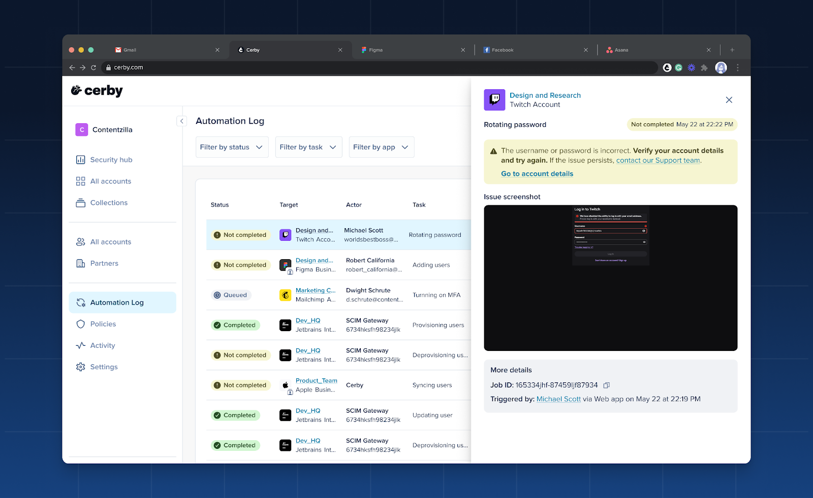

# Release Notes - August 21, 2025

## New features

The following are the new features and improvements we released across the Cerby platform:

* We now support authentication provider migrations for customer workspaces from Google OIDC to Okta SAML. Our migration path prevents any data loss and reenables external guest users (for example, agencies already onboarded into the workspace) post-migration.

### Supercharged automation logs: Find, fix, and audit faster than ever

We heard you needed a clearer way to track your automation jobs, and we went above and beyond. We've re-engineered our automation logs from the ground up to provide you with a powerful audit trail tool.

The new **Automation Log** page is your centralized view of all automation jobs triggered within your Cerby workspace. It's designed to help you with the following use cases:

* Diagnose issues with jobs that haven't completed successfully.
* Identify potential security threats and misconfigurations before they become a problem.
* Serve as a vital audit trail for compliance with corporate policy.

This tool is a critical part of how we empower you to protect your accounts and perform identity lifecycle management tasks with confidence. If you are interested in trying it out, contact your Customer Success Manager.

**Figure 1** shows how the **Automation Log** page and the side drawer with automation job details look.

**Figure 1.** **Automation Log** page and side drawer in the Cerby web app dashboard

For more information, read the article [Explore the Automation Log](https://cerby-test.gitbook.io/cerby-test/support-and-use-cases/explore/explore-the-automation-log).

### Cerby web app

Check out what’s new in our Cerby web app:

* We’ve improved the process of connecting a service account to a business hub. In the dialog box where you are prompted to select an account, we now display a “Connected” status for the accounts that are already connected to another business hub; additionally, these accounts cannot be selected.
The goal is to avoid misconfigurations due to selecting the same account for multiple business hubs.

* You can only share secrets via a public link when they have a text body.

### Cerby mobile app

Dive into the newest additions to our Cerby mobile app:

* We included a confirmation message to remind users to first remove the passkey from the app or service provider before deleting it from Cerby. This sequence ensures the passkey's public key is deactivated on the app's server, preventing it from being used for authentication and maintaining account security. It also provides a smoother user experience, as the app or service provider will then prompt for alternative login methods instead of attempting to use a non-existent passkey, ensuring consistency across all platforms. The message was released in iOS v1.0.247 and Android v1.0.206.
* We’ve implemented ephemeral web sessions to improve the login experience in the Cerby mobile app. We now let identity providers (IdPs) decide whether users must re-enter their credentials to access their workspace with their phone. This feature is available from versions iOS v1.0.250 and Android v1.0.208 onwards.
* As you do with the Cerby web app, you can now share an account via a public link with the Cerby mobile app. This feature, available from versions iOS v1.0.256 and Android v1.0.211 onwards, enables you to grant temporary access to your accounts and secrets for external parties who don’t have access to your Cerby workspace, such as contractors, agencies, partners, and vendors.
​**NOTE:** You cannot share secrets with attachments. If you attempt to do it, the Cerby mobile app will notify you about it.

  * We’ve released a new feature that improves the autofill experience using the Cerby mobile app. Now, when logging in to an account using autofill, we display a section with suggested self-managed accounts based on the app domain. This feature was released in iOS v1.0.257 and Android v1.0.211.
* * *

## Fixes

Take note of the issues addressed and resolved by the Development team behind the Cerby platform:

### Cerby web app

* The issue with not displaying account cards in the **Accounts** page when applying the **App or domain** filter from the **Group by** section of the **More filters** drop-down menu was fixed.
* The issue with being unable to download and view some secret attachments was fixed. This issue happened when attachments were incorrectly saved due to users interrupting the upload process by refreshing the page or closing the browser tab.
* The issue with deleting accounts from the **Emergency controls** section of the account details page was fixed. Some accounts were incorrectly deleted, causing that the corresponding accounts cards were displayed both as active and deleted.
* The issue with deleting an account with multi-factor authentication (MFA) turned on and managed by Cerby was fixed. For some accounts, a message was displayed in the deletion confirmation page indicating they couldn’t be deleted, even though the deletion was successful.
* The issue with not redirecting users to our documentation about the Password Manager Importer when importing items from a CSV file was fixed. The link redirected back to the Cerby web app dashboard instead of the article [Import your items from a CSV file to Cerby](https://cerby-test.gitbook.io/cerby-test/management/credential-management/item-importer/import-your-items-from-a-csv-file-to-cerby).
* The issue with being able to see the option to remove a secret from a team, even when a user doesn’t have the **Owner** role assigned, was fixed. This option was incorrectly displayed, as **Collaborators** cannot manage secrets.
* The issue with clicking the **Log in** button of some business hub cards and not starting a login flow was fixed.
* The issue with some **Guest Users** being able to connect a business hub was fixed. This is an action allowed only for workspace **Owners** , **Super Admins** , **Admins** , and **Users**.
* The issue with the search input disappearing while Cerby processes the search request when adding a business hub to a collection was fixed. The input reappeared after displaying the search results.

### Cerby browser extension

* The issue with not redirecting users to the external app after starting automated logins was fixed. From the Cerby browser extension v1.0.459 onwards, users are now redirected when they log in from the Cerby web app dashboard and then authenticating to their identity provider (IdP) and from their IdP dashboard.

### Cerby mobile app

  * The issue with iOS autofill for apps supporting passkeys and regular login methods was fixed. Previously, when an external app such as LinkedIn requested a passkey for login and users selected an account with only a password, Cerby was unable to autofill the password. This issue has been resolved in iOS v1.0.257, and now you can log in with any login method available.
* * *

## New supported managed apps

The following are the latest additions to the list of managed apps with supported automated tasks:

  * [Acquire](http://acquire-staging.com/)
  * [Apple Store Apps Assets](http://appstoreconnect.apple.com/)
  * [Apple Itunes Connect](http://appstoreconnect.apple.com/)
  * [AppSignal](http://appsignal.com/)
  * [Assembly AI](http://assemblyai.com/)
  * [Auvik Sites](http://my.auvik.com/)
  * [Backstage](http://backstage.com/)
  * [Beyond Trust PMC](http://pm.beyondtrustcloud.com/)
  * [Beyond Trust Cloud PRA](http://beyondtrustcloud.com/)
  * [Beyond Trust PS](http://ps.beyondtrustcloud.com/)
  * [Bloomerang Auth Identity](http://authidentity.bloomerang.co/)
  * [Certified Credit](http://certifiedcredit.meridianlink.com/)
  * [Cognism](https://app.cognism.com/)
  * [Confluent](http://confluent.cloud/)
  * [EAM DANE](http://formularios.dane.gov.co/)
  * [EPS SURA](http://epssura.com/)
  * [Firmable](http://firmable.com/)
  * [Ixopay](http://ixopay.com/)
  * [JP Morgan Chase](http://secure.chase.com/)
  * [Louisiana Wage & Tax System](http://esweb.revenue.louisiana.gov/)
  * [Marriott](http://marriot.com/)
  * [Mesh Payments](http://meshpayments.com/)
  * [OK ESC](https://www.ok.gov/oesc/newhire/app/index.php)
  * [Pressreader](http://pressreader.com/)
  * [Protección Empresa](http://proteccion.com/)
  * [Soc Care Plus](http://sistema.soc.com.br/)
  * [SURI](http://suri.hacienda.pr.gov/)
  * [Vercel](http://vercel.com/)
* * *

## New supported business hubs

The following are the latest additions to the list of business hubs with supported user management automated tasks:

* [Amazon DSP](http://advertising.amazon.com/)
* [Apple Store Apps Assets](http://appstoreconnect.apple.com/)
* [Apple Itunes Connect](http://appstoreconnect.apple.com/)
* [Apple Store](https://business.apple.com/)
* [AppSignal](http://appsignal.com/)
* [Articulate 360](http://articulate.com/)
* [Cognism](https://app.cognism.com/)
* [Confluent](http://confluent.io/)
* [Firmable](http://firmable.com/)
* [Gitlab](http://gitlab.com/)
* [Campaign Manager 360](http://campaignmanager.google.com/)
* [GTreasury Business](http://gtreasury.com/)
* [Impact.com](http://impact.com/)
* [Ixopay](http://ixopay.com/)
* [Jamf](http://jamf.com/)
* [Linkedin Recruiter](http://linkedin.com/)
* [SolarWinds](http://cloud.solarwinds.com/)
* [Solutions LCM](http://appsmith.cerby-solutions.com/)
* [Storylane](http://storylane.io/)
* [User Interviews Business](http://userinterviews.com/)
