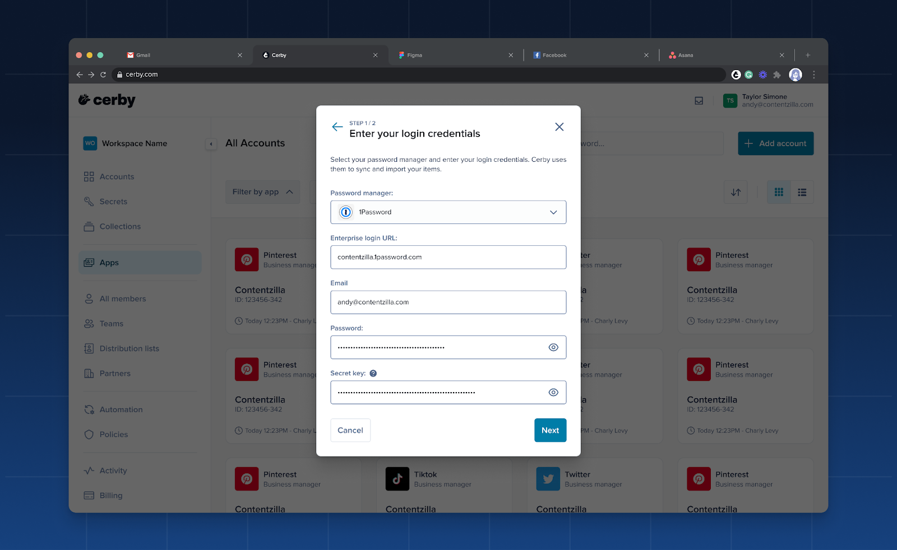
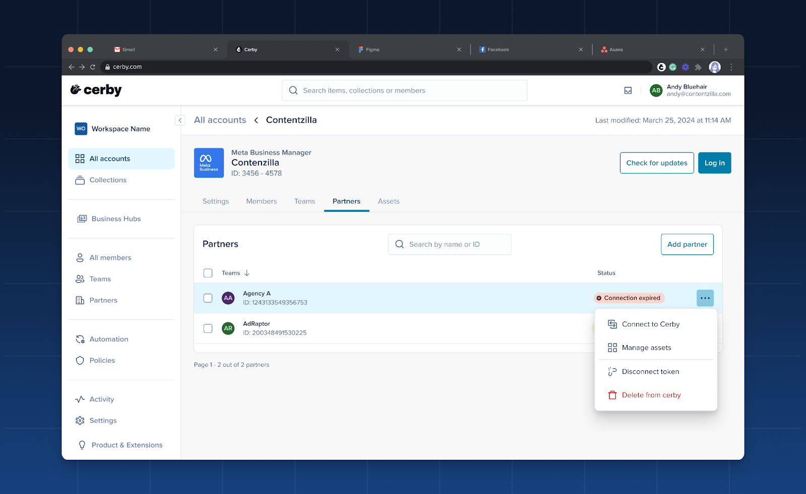
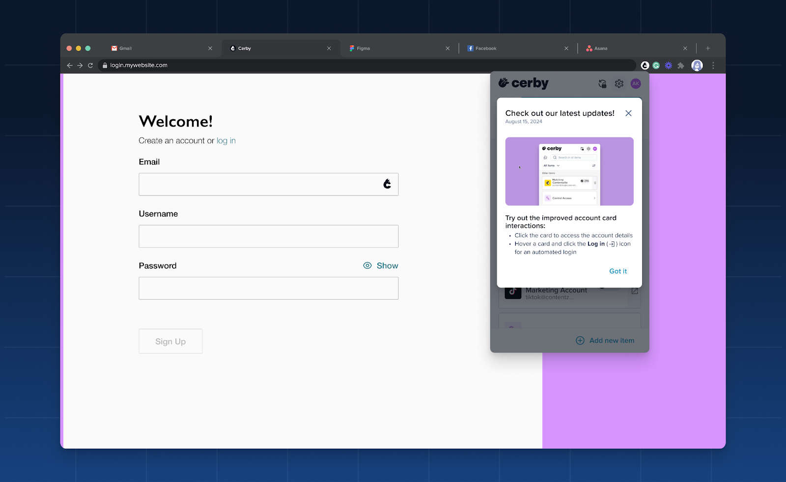
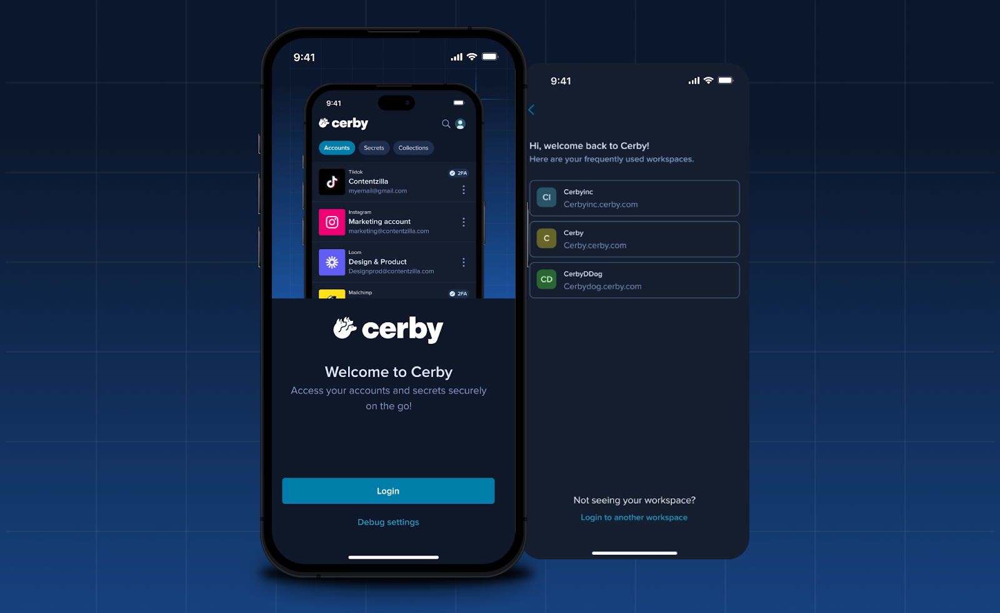

# Release Notes - September 28, 2024

## New features

The following are the new features and improvements we released across the Cerby platform:

* Looking for another reason to use Cerby? We’ve expanded the capabilities of our Password Manager Importer, and we now support migrations from 1Password.
With just a few clicks, you can transfer your vaults and items to start protecting and managing them from Cerby.
For more information on the import rules and item correspondences, read the article [Migrate from 1Password to Cerby](https://cerby-test.gitbook.io/cerby-test/management/credential-management/item-importer/migrate-from-1password-to-cerby). **Figure 1** shows how the import starts when you select 1Password.

**Figure 1.** **Enter your login credentials** dialog box of the Password Manager Importer

* If you manage or access a business hub through Cerby, we have good news!
  * Users of the [native partners](https://cerby-test.gitbook.io/cerby-test/support-and-use-cases/explore/explore-partners) feature, keep reading. As an integration **Owner** , you can now disconnect the token you have created for this feature and use a different token to continue collaborating with agencies, media planners, or consultants.
This feature is helpful for scenarios where the token expires, the token is incorrect when connecting the native partner, or your external collaborator changes. Just go to the **Partners** tab of the integration details page, click the **More options** () icon of the corresponding native partner, and select **Disconnect token** , as shown in **Figure 2**.

**Figure 2.** **Partners** tab of the integration details page

* We now support duplicated assets existing in multiple integrations. With this improvement, the number of assets in Cerby matches the assets you have in your seat-based and paid social apps.
* User accounts created by Cerby through an automated task are now removed from your workspace when the user is deprovisioned.

### Cerby web app

Check out what’s new in our Cerby web app:

* As relative as it could be, we know time is vital for you. That’s why we changed how we display the last accessed date on the account cards of the **Accounts** view. Instead of quarters, we now measure time in weeks, months, and years. The same happens in the **Last used** column within the **Members** tab inside the account details page.
* Our global search, located at the top of the Cerby web app dashboard, has been upgraded to provide a more comprehensive search experience. Previously, business hubs and accounts connected to an integration were not included in the search results. Now, you can search across all account types, making finding the information you need easier.
* We keep improving our Password Manager Importer to smooth your transition to Cerby. After selecting the LastPass folders or 1Password vaults to import, you can now deselect all of them to start all over again.
* With security in mind, we’ve restricted the ability to download the CSV report with the complete list of workspace members. Only workspace **Owners** , **Super Admins** , and **Admins** can now generate and download this information.
* To avoid misinterpretations, we’ve fine-tuned the message when deleting an account. Now, it’s clear that you are deleting a specific account saved in Cerby instead of your user account.
* Another one about messages in the user interface. When you have just created an account, we stopped displaying password rotation data to avoid giving the impression that the password was recently updated.

### Cerby browser extension

Explore the latest features in our Cerby browser extension:

* We've enhanced the user experience and ensured compliance with quality extension guidelines by adding a workspace selector to the extension popup. You can now enter or select your workspace before logging in to the extension through a new browser tab with your identity provider’s login page. This improvement was released in v1.0.298.
* Check out the following improvements we released in the extension v1.0.381:
  * The account cards have a new behavior. Now, when you click a card, the account details screen is displayed instead of triggering an automated login.
You can start the automated login by clicking the expandable **Auto-login** button.

* We now display feature presentations as soon as you log in to Cerby to inform you about the latest extension additions. **Figure 3** shows how it looks.

**Figure 3.** Feature presentation in the browser extension popup

* The inline menu now has a three-dotted () icon instead of a question mark to display the actions of turning off Cerby for a field or getting help through the support chat.

### Cerby mobile app

Dive into the newest additions to our Cerby mobile app:

* Unenthusiastic about re-entering your workspace name every time you log in to Cerby? We've got you covered! Now, when you open the welcome screen in the Cerby mobile app, we provide a list of your frequently used workspaces for you to select. Then, you are redirected to your identity provider’s login page to authenticate. This handy feature was released on iOS v1.0.201 and Android v1.0.172, as shown in **Figure 4**.

**Figure 4.** Welcome screen with frequently used workspaces

* Let us provide you with more details about the Android v1.0.172 release:
  * Talking about saving you some time, we have implemented suggestions in the autofill feature so you can see a list of recently used accounts.
  * We now support adding or removing custom fields when editing an account. By the way, from v1.0.173 onwards, you can add custom fields when creating an account using the Cerby mobile app.
* Here’s one for iOS users. In v1.0.197, we started supporting the deletion of secrets.
* Keep the improvements coming! With the releases of iOS v1.0.204 and Android v1.0.176, you can now experience the following:
  * The new look of the home screen.
  * A new full-screen view when tapping your profile icon, with the following options:
    * Settings
    * Trusted devices
    * Theme
    * Contact support
    * Help Center
    * Log Out

Yes, you read it right. You can now open the support chat through the Cerby mobile app and access our knowledge base to find answers to your questions.

## Fixes

Take note of the issues addressed and resolved by the Development team behind the Cerby platform:

* The issue with not assigning the workspace **Owner** role correctly in some cases when creating a workspace is fixed.

### Cerby web app

* The issue with the **Change role type** dialog box not being displayed when updating a user's role on an account through the **Members** tab was fixed. This issue happened when the account was shared with the user individually and via a team.
* The issue with the persistent loading state when entering a nonexistent workspace name in the Cerby web app login page or in the address bar was fixed. Now, the web app shows an error message and redirects the user to the URL <https://app.cerby.com/>.
* The issue with being unable to delete an account with multi-factor authentication (MFA) turned on after selecting the **Reset account settings** option was fixed. This issue happened because the automated task to turn off MFA was not triggered.
* The issue with not finding workspace members through search bars was fixed. This issue happened, for example, in the dialog box for sharing an account or when adding members to a team, even when the user existed in the workspace.
* The issue with displaying an identity confirmation challenge different from the predetermined multi-factor authentication (MFA) method was fixed. The available MFA methods are push notifications to the Cerby mobile app and email magic links.

### Cerby browser extension

* The issue with suggesting autofilling the user’s work email even when the email is already in the input field of a signup page was fixed in v1.0.321.
* The issue with not displaying the password generator on signup forms for Apple and Apple Business was fixed in v1.0.333.
* The issue with the inline menu not being displayed in some multi-step login forms and MFA code fields was fixed in v1.0.324.
* The issue with displaying the inline menu in an input field even when a user has disabled it for this field was fixed in v1.0.324.
* The issue with incorrectly showing the offline status in the extension icon even when some users have an active session was fixed in v1.0.337.

### Cerby mobile app

* The issue with Instagram and Facebook not recognizing the username when using autofill was fixed in Android v1.0.172.
* The issue with the Cerby mobile app crashing after disabling an unnamed trusted device was fixed in Android v1.0.173.
* The issues with the following role updates were fixed in iOS v1.0.198 and Android v1.0.173:
  * The team’s role on an account, a secret, and a collection.
  * The guest user’s role on an account, a secret, and a collection.
* The issue with having to select a collection when creating a secret was fixed in iOS v1.0.194.
* The issue with being unable to copy the verification code after scanning the QR code was fixed in iOS v1.0.195.

## New supported managed apps

The following are the latest additions to the list of managed apps with supported automated tasks:

* [ADP Workforcenow](http://online.adp.com/)
* [A-SCEND](https://a-scend2.com/)
* [Autodesk](https://www.autodesk.com/)
* [Backslash](https://www.backslash.security/)
* [ChatGPT](https://openai.com/)
* [Computershare](https://issueronline.com/)
* [Entra ID](https://www.microsoft.com/)
* [Iterable](https://iterable.com/)
* [JP Morgan Chase](https://secure.chase.com/web/auth/?treatment=jpo)
* [Litmus](https://www.litmus.com/)
* [Make](https://www.make.com/en)
* [Microsoft Advertising](https://login.microsoftonline.com/)
* [Ngrok](http://ngrok.com/)
* [Productboard](https://app.productboard.com/)
* [Secure Trust](http://managepci.com/)
* [Smartsheet](http://smartsheet.com/)
* [Yotascale](http://yotascale.io/)
