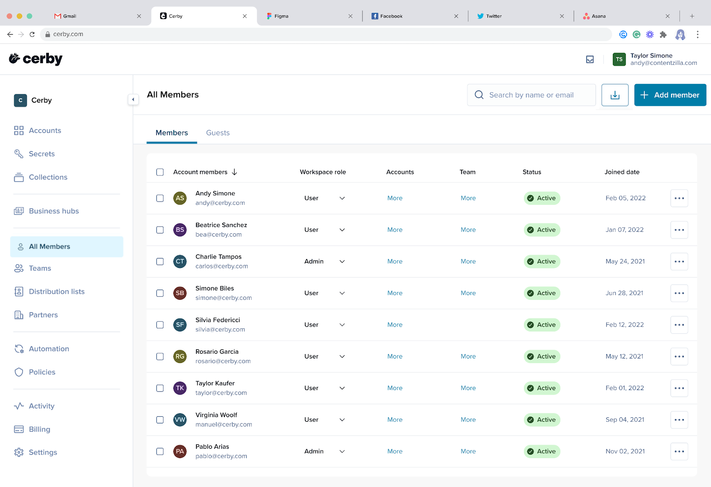

# Explore Cerby

Cerby is the identity automation platform purpose-built to secure disconnected applications—those that fall outside the reach of traditional identity security tools.

By integrating with existing IAM, IGA, and PAM systems, Cerby brings centralized access controls, automates manual security tasks, and extends governance across your entire application ecosystem. IT and security teams gain complete visibility and control, reducing risk and operational overhead.

Founded in 2020, Cerby is backed by leading investors and trusted by enterprises across the globe.

<figure><figcaption></figcaption></figure>
