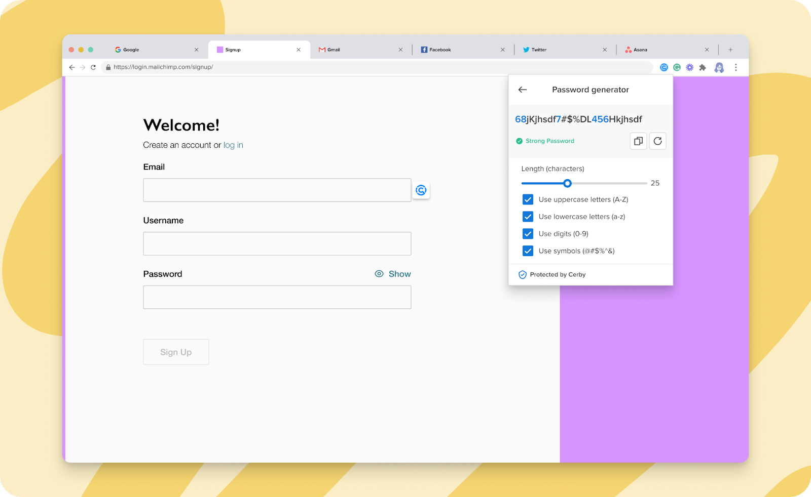

# Explore the Password Generator

**Release date:** October 2, 2023

We already had it, and now you can use it whenever you want for your accounts. The Password Generator is here.

We eagerly counted the days until we released this feature, which enables you to generate strong and secure passwords anytime. Previously, the agent in charge of the password rotations via automation tasks was the only one using the Password Generator.

Now, you can use the Cerby browser extension to generate passwords that meet the password requirements of your applications and service providers. You only need to select the applicable password strength rules:

* Length
* Uppercase letters
* Lowercase letters
* Digits
* Symbols

Based on your selection, the Password Generator also lets you know how weak or strong the generated password is.



**IMPORTANT:** A password is stronger the more rules you select and the longer the password is. According to [Hive Systems](https://www.hivesystems.io/password), it would take 226 years to hack a 12-character password that comprises numbers, upper and lowercase letters, and symbols.



Check out the Password Generator in the Cerby browser extension, as shown in **Figure 1**.

**Figure 1.** **Password generator** page in the Cerby browser extension popup

## Can’t wait, let’s start

If you are as excited as us about this new feature, here’s what you have to do next:

1. Open the Cerby browser extension popup
2. Open the Password generator
3. Start generating passwords

For detailed instructions, read the [How to generate secure passwords using the Cerby browser extension](https://help.cerby.com/en/articles/8377075-how-to-generate-secure-passwords-using-the-cerby-browser-extension) article.

## Hold on. There's more?

Sit tight. Our Development team is currently working on the following features to be released soon:

* The ability to generate passwords when saving your credentials at signup and login
* The ability to generate passwords via the inline extension
