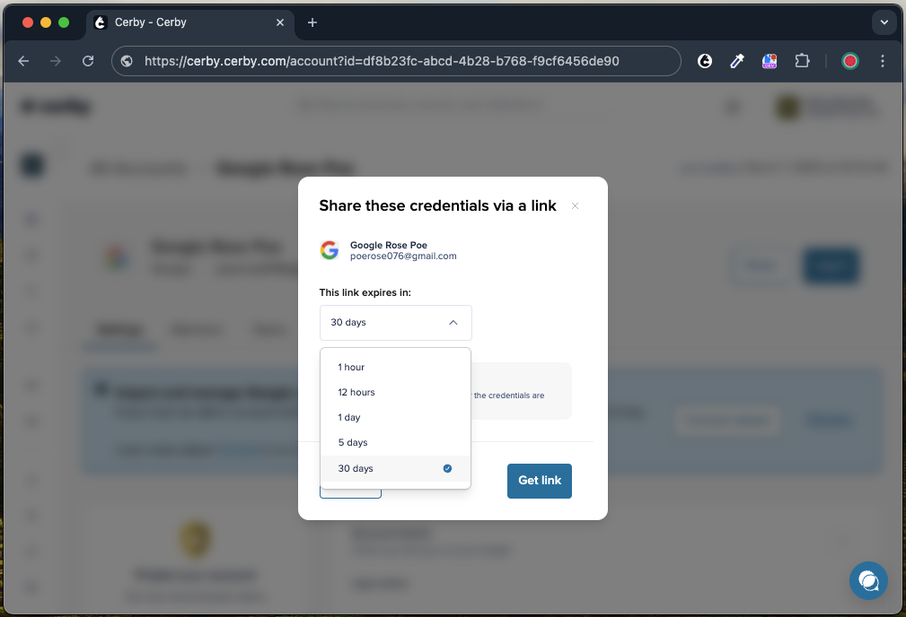
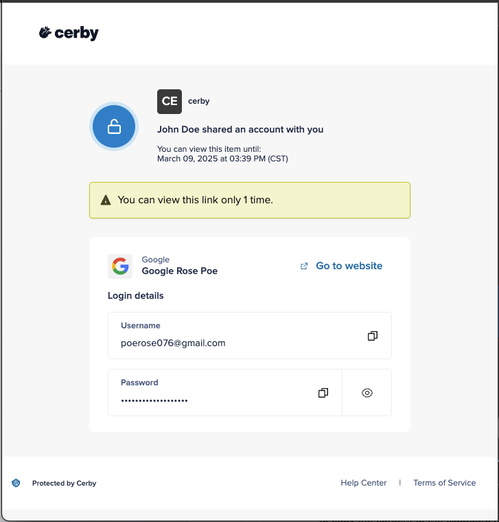

# Share items with external users via a link

With Cerby, you can share your items with external users through a public link.

This feature enables you and your company to collaborate with external parties, such as contractors, agencies, partners, vendors, and clients who don’t have access to a Cerby account or secret. By sharing a link with them, you can grant temporary access to the account and secret details.

For security, you can set the following controls on the link:

* Expiration
* One-time access

Only users with the **Owner** role on the accounts or secrets are able to use this feature through the Cerby web app. Currently, you can share accounts with or without multi-factor authentication (MFA) turned on and secrets without attachments.

This article describes how to share items with external users via a public link.



**IMPORTANT:** Before using this feature, make sure you read the [Security considerations](share-items-with-external-users-via-a-link.md#security-considerations) section because it describes how this feature works, the security considerations, and usage recommendations.



## Security considerations

Although the item details are encrypted and protected by Cerby, sharing public links involves some risks that you must keep in mind. You are granting direct access to sensitive corporate information without requiring external users to authenticate with an identity provider (IdP).

Cerby recommends that you adhere to the following security best practices:

* Share accounts and secrets only with people you trust and who follow security best practices.
* Set controls on the link expiration time and access when generating the link.
* Manually rotate the passwords for your accounts as soon as the link expires or if you detect suspicious activity or misuse.
* Use secure, encrypted, and direct communication channels when sharing the link, for example:
  * **Encrypted messaging apps:** Apps like Keybase, Signal, or Telegram offer end-to-end encryption to protect and delete your messages.
  * **Encrypted video conference apps:** Apps like Google Meet, Microsoft Teams, or Zoom offer end-to-end encryption for video calls.
  * **Encrypted email service providers:** Email service providers like ProtonMail, Tutanota, and Mailbox.org offer end-to-end encryption for your messages. Emails are not inherently encrypted solutions; therefore, Cerby recommends asking your IT or Security department about the protection level of your corporate email.

  **IMPORTANT:** Avoid using public and insecure channels, such as social media posts, regular emails, public Wi-Fi networks, shared spreadsheets and documents, and SMS messages.

* Avoid clicking links if they come from untrusted or suspicious sources.

By using this feature, users assume responsibility for the security of shared information. Cerby is not liable for any unauthorized access resulting from improper handling of the link.

## Share items via a public link

To share items with external users via a public link, you must complete the following steps:

1. Log in to your corresponding [Cerby](https://app.cerby.com/) workspace.
2. Open the page of the item you want to share:

   * To share an account

     1. Select the **All accounts** option from the left navigation drawer. The **All accounts** page is displayed.

   * To share a secret

     1. Select the **Secrets** option from the left navigation drawer. The **Secrets** view is displayed.
3. Click the **Share (****)** icon of the corresponding account or secret card. A drop-down list is displayed.
4. Select the **Share via public link** option. The link share dialog box is displayed, as shown in **Figure 1**.

**Figure 1.** Link share dialog box

5. Set the following controls on the link:

   * Expiration time

     1. Click the **This link expires in** drop-down list to expand it.
     2. Select the option that corresponds with the link expiration time you want:

        * **1 hour**
        * **12 hours**
        * **1 day**
        * **5 days**
        * **30 days**

        **IMPORTANT:** The maximum number of days an external link or QR code can last is 30 days.

   * One-time access

     1. Select the **Can be viewed only 1 time** option if you want the link to be inaccessible after the item is viewed by anyone with the link.
6. Click the **Get link** button. The **Confirm your identity to get the link** dialog box is displayed, and you get an email to confirm your identity.
7. Click the **Confirm my identity** button in the email you received. A dialog box with the link and a QR code is displayed in the Cerby web app.
8. Copy the link or take a screenshot of the QR code and share it via the secure communication channel of your choice.
9. Click the **Done** button. The dialog box closes.

Now you are done.

## View the item shared with you via a public link

To view the details of the item shared with you via a public link, you must complete the following steps depending on the item type:

* Account

  1. Open the link that was shared with you or scan the QR code using your mobile phone. The **A shared item is waiting for you** page or screen is displayed.
  2. Click the **View shared item** button. A page or screen is displayed with the account details, as shown in **Figure 2**.

**Figure 2.** Account details page of the public link

3. Use the corresponding **Copy** () icon of the **Username** and **Password** fields to copy the content to the clipboard and paste it on the login page or screen of the app.
4. Set up your authenticator app if MFA is turned on for the account by performing the following actions:

**NOTE:** With an authenticator app installed on your mobile phone, you can retrieve the verification codes you need to log in to the account. Some examples are Google Authenticator, Okta Verify, Microsoft Authenticator, Duo Mobile, and Authy.

1. Open the authenticator app on your mobile phone.
2. Follow the instructions to add an account by scanning the QR code. The account is added to the authenticator app, and a time-based verification code is generated.

**NOTE:** If you cannot scan the QR code, copy the MFA key provided on the account details page and follow the instructions to add an account to your authenticator app by manually entering a key.

* Secret

  1. Open the link that was shared with you or scan the QR code using your mobile phone. The **A shared item is waiting for you** page or screen is displayed.
  2. Click the **View shared item** button. A page or screen is displayed with the secret details.
  3. Click the **Copy** () icon to copy the body of the secret to the clipboard.
