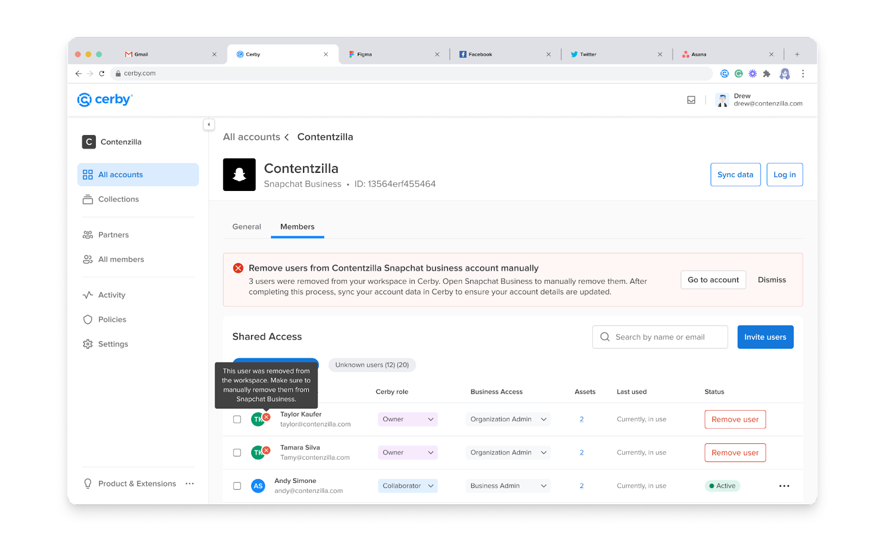

# Troubleshooting: Manually Removing Users from Business Center Accounts

This article helps you fix the unsuccessful removal of users in business center accounts when deprovisioned from the corporate directory of your Identity Provider (IdP) or removed from Cerby.

## Cause of the Problem

The unsuccessful removal of users in business center accounts may be due to one of the following scenarios:

* When you remove users from the corporate directory synchronized between Cerby and your IdP, sometimes the deprovisioning of users from your business center accounts fails.
* Currently, Cerby doesn't support deprovisioning for all business centers.
* When you remove users in Cerby and don't have a corporate directory synchronized, the deprovisioning doesn't occur.

If Cerby detects that some users are not removed from business center accounts, we notify the Account Owner and Workspace Admin via email. We also flag the accounts and users that require action, as shown in **Figure 1**.

**Figure 1. Flagged Accounts in the Members Tab**

## Solution

You must manually remove users from your business center accounts to solve this problem. We will guide you to remove the corresponding users from each business center account in Cerby. When you complete the process, sync the account data for each business center account in Cerby.

The removal process is different depending on the business center. In this article, we cover the following business centers:

* [Facebook Business Manager](troubleshooting-manually-removing-users-from-business-center-accounts.md#facebook-business-manager)
* [Google Ads Manager](troubleshooting-manually-removing-users-from-business-center-accounts.md#google-ads-manager)
* [Pinterest Business](troubleshooting-manually-removing-users-from-business-center-accounts.md#pinterest-business)
* [Snapchat Business Manager](troubleshooting-manually-removing-users-from-business-center-accounts.md#snapchat-business-manager)
* [TikTok Business Center](troubleshooting-manually-removing-users-from-business-center-accounts.md#tiktok-business-center)

The following sections describe the instructions for each business center.

### Facebook Business Manager

To manually remove users from your Facebook Business Manager account, you must complete the following steps:

1. Access your Facebook Business Manager account from Cerby.
2. Click the **Business settings** ( ⚙️ ) icon located at the bottom of the left navigation drawer.
3. Click the **People** button from the **Users** drop-down list.
4. Select the corresponding user from the list.
5. Click the **More** button located at the top right.
6. Select the **Remove from Business Account** option.
7. Click the **Remove** button to confirm you want to remove access.
8. Go back to Cerby to sync the data of your account.

### Google Ads Manager

To manually remove users from your Google Ads Manager, you must complete the following steps:

1. Access your Google Ads account from Cerby.
2. Click the **Tools and Settings** button in the top navigation menu.
3. Select the **Access and security** option from the **Setup** list.
4. Click the **Remove access** button of the corresponding user in the list.
5. Click the **Remove access** button to confirm you want to remove access.
6. Go back to Cerby to sync the data of your account.

### Pinterest Business

To manually remove users from your Pinterest Business account, you must complete the following steps:

1. Access your Pinterest Business account from Cerby.
2. Click the down arrow ( ⬇️ ) icon located at the top-right corner of the window, next to the profile button.
3. Select the **Business Access** option.
4. Click the **Employees** button from the left menu.
5. Select the corresponding user from the list.
6. Click the **Remove** button located to the right under the **Actions** column.
7. Click the **Remove** button to confirm you want to remove access.
8. Go back to Cerby to sync the data of your account.

### Snapchat Business Manager

To manually remove users from your Snapchat Business Manager account, you must complete the following steps:

1. Access your Snapchat Business Manager account from Cerby.
2. Click the **Members** button located in the left navigation drawer.
3. Click the right arrow ( ➡️ ) icon of the corresponding user.
4. Click the **Remove Member** button located in the top right.
5. Click the **OK** button to confirm you want to remove access.
6. Go back to Cerby to sync the data of your account.

### TikTok Business Center

To manually remove users from your TikTok Business Center account, you must complete the following steps:

1. Access your TikTok Business Center account from Cerby.
2. Click the **Members** button from the **Users** drop-down list.
3. Select the corresponding user from the list.
4. Click the **Remove** ( 🗑 ) icon located in the top right.
5. Click the **Remove** button to confirm you want to remove access.
6. Go back to Cerby to sync the data of your account.
